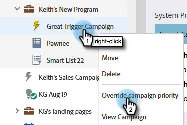

# トリガーキャンペーンの優先度の上書き {#priority-override-for-trigger-campaigns}

管理者は、Marketo が決定した優先度を上書きして、トリガー目標に合わせた優先度を設定できます。

>[!NOTE]
>
>この機能は、トリガーキャンペーンと、[「トリガーキャンペーンの優先度の編集」権限](#grant-priority-override-access)を付与されたユーザのみが使用できます。

>[!CAUTION]
>
>この機能は、ビジネスクリティカルなキャンペーンの限られたセットで使用することを強くお勧めします（最大 25 が推奨されます）。大きなセットで大まかに機能を使用すると、キャンペーンの実行全体に悪影響を与える可能性があります。

## 優先度の上書きアクセスの付与 {#grant-priority-override-access}

>[!NOTE]
>
>管理者または管理者の責任を持つユーザのみが、キャンペーンの優先度の上書きにアクセスできる必要があります。

1. [!UICONTROL 管理者]領域で、「**[!UICONTROL ユーザ＆ロール]**」をクリックします。

   

1. 「**[!UICONTROL ロール]**」タブをクリックし、アクセスを許可するユーザを選択し、「**[!UICONTROL ロールを編集]**」をクリックします。

   

1. [!UICONTROL マーケティング活動にアクセス]で、「**[!UICONTROL トリガーキャンペーン優先度を編集]**」を選択します。「**[!UICONTROL 保存]**」をクリックします。

   

## 優先順位の上書き {#override-priority}

1. トリガーキャンペーンを探します。右クリックして、「**[!UICONTROL キャンペーン優先度の上書き]**」を選択します。

   

1. 「**[!UICONTROL キャンペーン優先度の上書き]**」スライダーを使用して有効にします。新しい優先度レベルを選択し、「**[!UICONTROL 確認]**」をクリックします。

   

   新しい優先度レベルが「スケジュール」タブに表示されます。

   

>[!NOTE]
>
>* キャンペーンのデフォルトの優先度は、[!UICONTROL マーケティング活動]の[!UICONTROL キャンペーンキュー]で確認できます。実行レートを上げるには、キャンペーンの優先順位をデフォルトより 1 レベル高く設定することをお勧めします。
>* ユーザ設定の優先度は、キャンペーンの条件を満たす新しい人物にのみ適用されます。既にキューに入っている人物は影響を受けません。
>* 優先度の上書きは、[監査証跡](/help/marketo/product-docs/administration/audit-trail/audit-trail-overview.md)によって取得されます。

