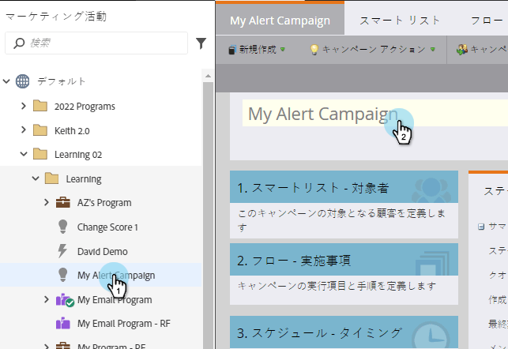
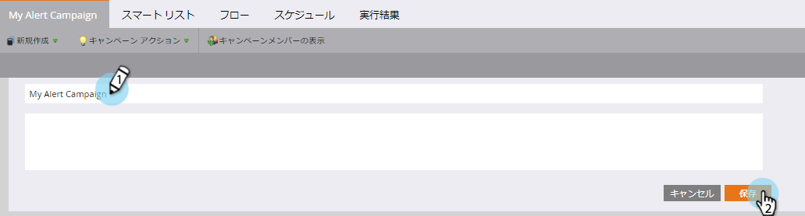

# スマートキャンペーン名の変更{#rename-a-smart-campaign}

既存のスマートキャンペーンの名前を変更できます。 これが方法です。

1. 「マーケティングアクティビティ」に移動します。

   

1. スマートキャンペーンを選択し、名前をクリックします。

   

   >[!TIP]
   >
   >プログラム内のスマートキャンペーン名は、常に&#39;ProgramName.CampaignName&#39;の形式に変換されます。

1. 新しいスマートキャンペーン名を入力し、「保存」をクリックします。

   

   >[!NOTE]
   >
   >古い名前はタブに表示され、保存時に変更されます。

早く簡単に！ スマートキャンペーンが参照されている箇所も変更されます。