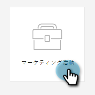
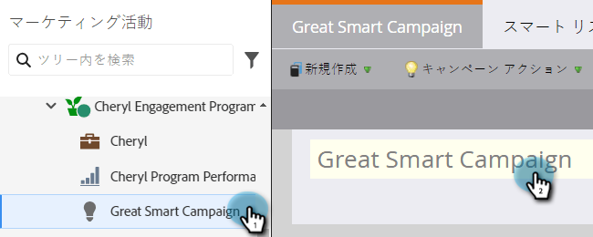
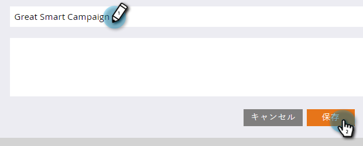

# スマートキャンペーン名の変更 {#rename-a-smart-campaign}

既存のスマートキャンペーンの名前を変更できます。手順は次のとおりです。

1. 「**[!UICONTROL マーケティング活動]**」に移動します。

   

1. スマートキャンペーンを選択し、右側のスマートキャンペーン名をクリックします。

   

   >[!TIP]
   >
   >プログラム内のスマートキャンペーン名は、常に「プログラム名.キャンペーン名」の形式に変換されます。

1. 新しいスマートキャンペーン名を入力し、「**[!UICONTROL 保存]**」をクリックします。

   

   >[!NOTE]
   >
   >古い名前はタブに表示され、保存時に変更されます。

簡単でしたね。スマートキャンペーンの参照元もすべて変更されます。
