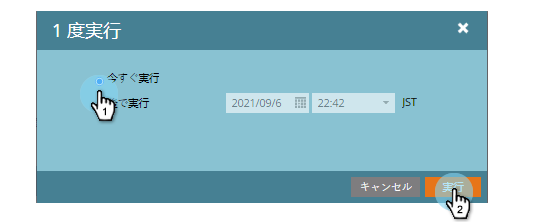
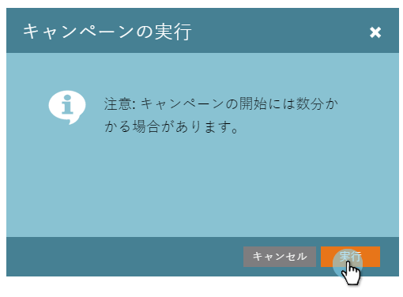

# バッチスマートキャンペーンを今すぐ実行 |スケジュールタブ{#run-a-batch-smart-campaign-now-schedule-tab}

バッチキャンペーンの作成が完了したら、今すぐ実行するか、後で実行するかを選択できます。 すぐに実行する方法を次に示します。

1. バッチスマートキャンペーンを選択し、「**スケジュール**」タブに移動し、「**1回実行**」をクリックします。

   

1. 「**今すぐ実行**」が選択されていることを確認し、「**実行**」をクリックします。

   

1. 確認するには、[**実行**]をもう1回クリックします。

   

   楽勝！ [後の](/help/marketo/product-docs/core-marketo-concepts/smart-campaigns/using-smart-campaigns/schedule-a-batch-smart-campaign-to-run-later.md)に対して実行するスケジュールも好みに応じて設定できます。

   >[!NOTE]
   >
   >* [バッチスマートキャンペーンを後で実行するようにスケジュールする](/help/marketo/product-docs/core-marketo-concepts/smart-campaigns/using-smart-campaigns/schedule-a-batch-smart-campaign-to-run-later.md)
   >* [定期バッチキャンペーンのスケジュール](/help/marketo/product-docs/core-marketo-concepts/smart-campaigns/using-smart-campaigns/schedule-a-recurring-batch-campaign.md)

