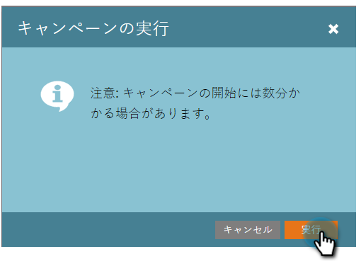

# バッチスマートキャンペーンの即時実行 | 「スケジュール」タブ {#run-a-batch-smart-campaign-now-schedule-tab}

バッチキャンペーンの作成が完了したら、今すぐ実行するか、後で実行するかを選択できます。 すぐに実行する方法を次に示します。

1. バッチキャンペーンを選択し、「**[!UICONTROL スケジュール]**」タブに移動して、「**[!UICONTROL 1 回実行]** をクリックします。

   

1. 「**[!UICONTROL 今すぐ実行]**」が選択されていることを確認し、「**[!UICONTROL 実行]**」をクリックします。

   

1. 「**[!UICONTROL 実行]**」をもう一度クリックして確定します。

   

   簡単ですね。また、必要に応じて、[スケジュールを後で実行](/help/marketo/product-docs/core-marketo-concepts/smart-campaigns/using-smart-campaigns/schedule-a-batch-smart-campaign-to-run-later.md){target="_blank"}することもできます。

   >[!NOTE]
   >
   >* [後で実行するようにバッチスマートキャンペーンをスケジュール](/help/marketo/product-docs/core-marketo-concepts/smart-campaigns/using-smart-campaigns/schedule-a-batch-smart-campaign-to-run-later.md){target="_blank"}
   >* [繰り返しバッチキャンペーンのスケジュール](/help/marketo/product-docs/core-marketo-concepts/smart-campaigns/using-smart-campaigns/schedule-a-recurring-batch-campaign.md){target="_blank"}
