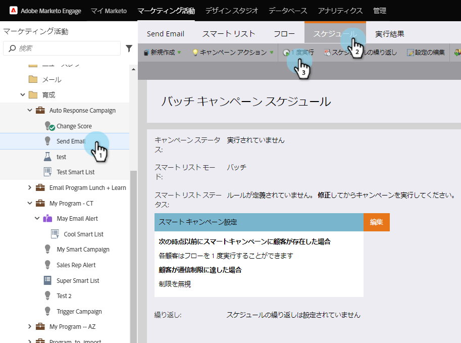
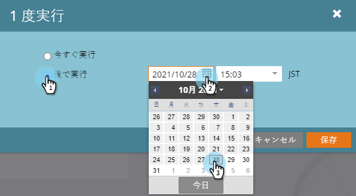
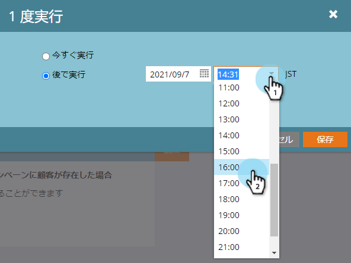
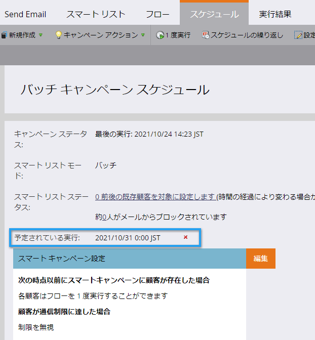

# バッチスマートキャンペーンを後で実行するようにスケジュールする{#schedule-a-batch-smart-campaign-to-run-later}

バッチスマートキャンペーンを将来的な時点で実行するように設定する場合は、次のようにします。

>[!TIP]
>
>また、プログラムスケジュール表示](../../../../product-docs/core-marketo-concepts/programs/program-schedule-view/reschedule-a-batch-smart-campaign-in-the-program-schedule-view.md)のバッチスマートキャンペーンを[再スケジュールすることもできます。

1. 実行するバッチスマートキャンペーンを選択し、「**スケジュール**」タブに移動し、「**1回実行**」をクリックします。

   

1. 「**後で実行**」をクリックし、カレンダーアイコンをクリックして、スマートキャンペーンを実行する日を選択します。

   

1. スマートキャンペーンを実行する時間を選択します（少なくとも15分前）。

   

1. 「**保存**」をクリックします。

   

1. **「スケジュール**」タブを見ると、スケジュールされた実行を確認できます。

   

   >[!NOTE]
   >
   >**関連記事**
   >
   >    
   >    
   >    * [定期バッチキャンペーンのスケジュール](schedule-a-recurring-batch-campaign.md)

