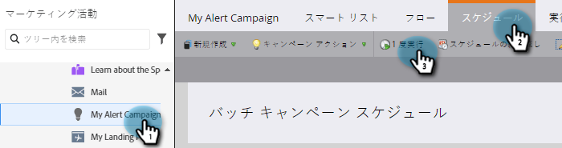
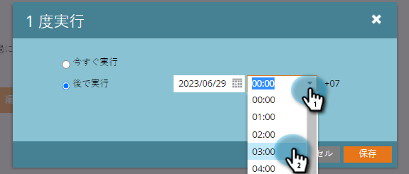
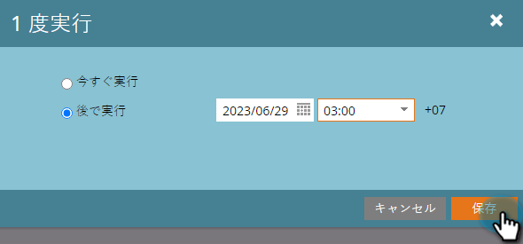
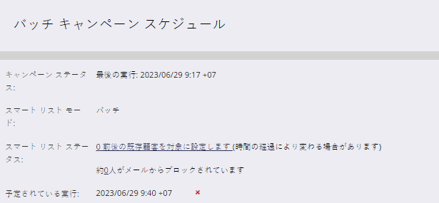

# 後で実行するようにバッチスマートキャンペーンをスケジュール {#schedule-a-batch-smart-campaign-to-run-later}

バッチスマートキャンペーンを未来の任意の時点で実行するように設定する場合は、次の手順に従います。

>[!TIP]
>
>[プログラムスケジュール表示でバッチスマートキャンペーンを再スケジュール](/help/marketo/product-docs/core-marketo-concepts/programs/program-schedule-view/reschedule-a-batch-smart-campaign-in-the-program-schedule-view.md)することもできます。

1. 実行するバッチスマートキャンペーンを選択し、「**スケジュール**」タブに移動して「**1 回実行**」をクリックします。

   

1. 「**後で実行**」をクリックし、カレンダーアイコンをクリックして、スマートキャンペーンを実行する日を選択します。

   

1. スマートキャンペーンを実行する時間を選択します（15 分以上先）。

   

1. 「**保存**」をクリックします。

   

1. スケジュールされた実行を確認するには、「**スケジュール**」タブをクリックします。

   

   >[!NOTE]
   >
   >[繰り返しバッチキャンペーンのスケジュール](/help/marketo/product-docs/core-marketo-concepts/smart-campaigns/using-smart-campaigns/schedule-a-recurring-batch-campaign.md)
