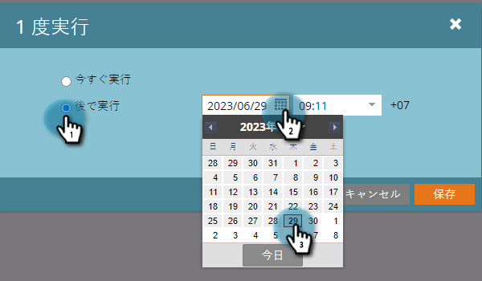

# 後で実行するようにバッチスマートキャンペーンをスケジュール {#schedule-a-batch-smart-campaign-to-run-later}

バッチキャンペーンを今後のある時点で実行するように設定する場合は、次の方法で設定できます。

>[!TIP]
>
>[プログラムスケジュール表示でバッチスマートキャンペーンを再スケジュール](/help/marketo/product-docs/core-marketo-concepts/programs/program-schedule-view/reschedule-a-batch-smart-campaign-in-the-program-schedule-view.md){target="_blank"}することもできます。

1. 実行するバッチスマートキャンペーンを選択し、「**[!UICONTROL スケジュール]**」タブに移動して「**[!UICONTROL 1 回実行]**」をクリックします。

   

1. 「**[!UICONTROL 後で実行]**」をクリックし、カレンダーアイコンをクリックして、スマートキャンペーンを実行する日を選択します。

   

1. スマートキャンペーンを実行する時間を選択します（15 分以上先）。

   

1. 「**[!UICONTROL 保存]**」をクリックします。

   

1. スケジュールされた実行を確認するには、「**[!UICONTROL スケジュール]**」タブをクリックします。

   

   >[!NOTE]
   >
   >[繰り返しバッチキャンペーンのスケジュール](/help/marketo/product-docs/core-marketo-concepts/smart-campaigns/using-smart-campaigns/schedule-a-recurring-batch-campaign.md){target="_blank"}
