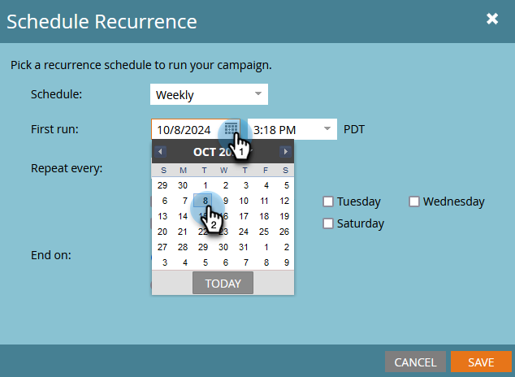
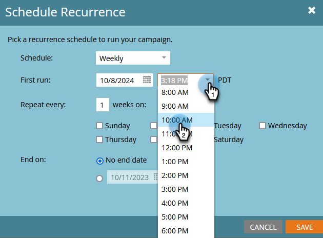

# 繰り返しバッチキャンペーンのスケジュール {#schedule-a-recurring-batch-campaign}

繰り返しを使用すると、バッチキャンペーンを定期的なスケジュールで実行できます。 例：週に 1 回、火曜日午前 10:00。

1. スマートキャンペーンを選択し、「**[!UICONTROL スケジュール]**」タブに移動して、「**[!UICONTROL 繰り返しをスケジュール]**」をクリックします。

   

1. **[!UICONTROL スケジュール]** ドロップダウンをクリックし、「**[!UICONTROL 毎週]**」を選択します。

   

1. カレンダーアイコンをクリックし、最初の実行に使用する日付を選択します。

   

1. 実行する時刻を選択します。

   

1. 「[!UICONTROL &#x200B; 繰り返し間隔 &#x200B;]」を 1 のままにし、「火曜日」を選択して「保存 **[!UICONTROL をクリックし]** す。

   

   >[!NOTE]
   >
   >特定の実行長の場合は、「終了日 **[!UICONTROL の横にあるカレンダーアイコンをクリックして、終了日を選択]** きます。

スケジュールされた繰り返しは、「スケジュール」タブの下部に表示されます。

>[!NOTE]
>
>「スケジュール」タブには、参照用に次の 3 つのオカレンスが表示されます。 赤い **X** をクリックすると、その特定の実行がキャンセルされます。
