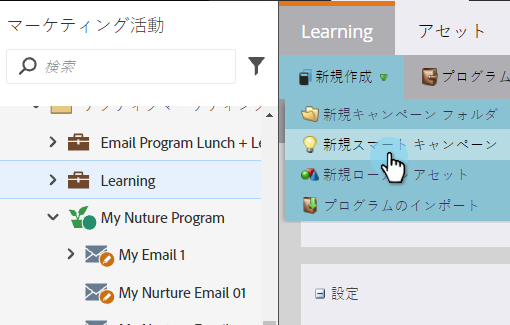
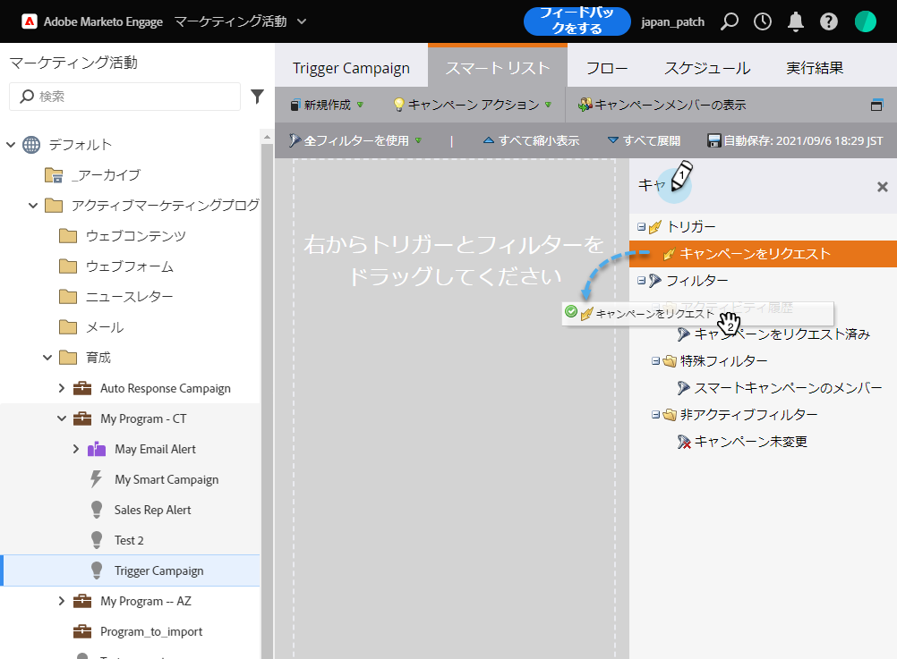
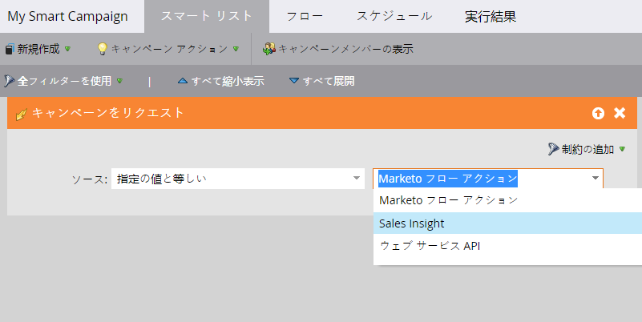

# 「キャンペーンは要求されました」を使用した販売用のトリガースマートキャンペーンの設定{#setting-up-a-trigger-smart-campaign-for-sales-using-campaign-is-requested}

Marketoの最も優れた機能の1つは、販売担当者がマーケティング活動に参加できることです。 彼らは第一線に立って人と交流しています 営業担当者は、マーケティングを適切な方向に導く能力が必要です。

>[!NOTE]
>
>要求するスマートキャンペーンの例：
>
>1. **長期的な育成**  — 今年は予算がなく、ただ監視を続けたいと思う場合
>1. **有効な販売サイクル**  — 販売担当者が、自分以外の個人に対するメッセージを望まない場合。（一時的に購読を取り消すには、マーケティングの一時停止フラグを使用）

>
>
創造力を持って。 販売担当者は何を自動化したいと思いますか。 彼らに聞いて、電報を打て！

1. **スマートキャンペーンを作成します。**

   

1. **キャンペーンが要求されました**&#x200B;を探してキャンバスにドラッグします。

   

1. ソースの選択肢は、どの種類の要求を引き継ぐかを示します。 Salesforce機能の場合、必ず&#x200B;**売上** **Insight**&#x200B;を選択してください。

   >[!TIP]
   >
   >ソース演算子はセキュリティを目的としています。 他のスマートキャンペーンや開発者など、特定のソースによってのみ実行されるリクエストにキャンペーンを制限できます。 すべてのソースからのリクエストを許可する場合は、最初のボックスで「**いずれか**」を選択します。
   >
   >**「Sales Insight**」を選択すると、Salesのボックスに魔法のように表示されます。やり過ぎないで。 多すぎると無視される。

   

これは、他の部門にもマーケティングのリーチを広げる優れた方法です。 自動化する様々なキャンペーンを設定します。

>[!TIP]
>
>スマートキャンペーンの名前をはっきりと付けるのを忘れないでください。 Sales Insightでは、お客様がどのように名前を付けたかが正確に表示されます。
