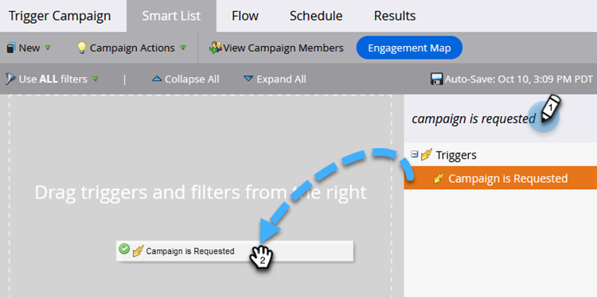

# 「キャンペーンをリクエスト」を使用して、セールス向けにトリガー付きスマートキャンペーンを設定 {#setting-up-a-trigger-smart-campaign-for-sales-using-campaign-is-requested}

Marketo で特に便利な機能のひとつが、セールス担当者をマーケティング業務に参加させられる機能です。 彼らは最前線に立って人々とやり取りを行います。 セールス担当は、適切な方向にマーケティングを導く能力を持つ必要があります。

>[!NOTE]
>
>リクエストするスマートキャンペーンの例：
>
>1. **長期的なナーチャリング** – 今年は予算がなく、注目を集めたい場合
>1. **アクティブな販売サイクル** – 販売担当者が自分の販売以外のユーザーにメッセージを送信しない場合。 （一時的に登録解除するには、マーケティング中断フラグを使用）。
>
>営業部門に、自動化したいタスクと設定について尋ねましょう。

1. スマートキャンペーンの作成。

   

1. **[!UICONTROL キャンペーンがリクエスト済み]**&#x200B;トリガーを検索してキャンバスにドラッグします。

   

1. 選択肢には、優先するリクエストの種類が示されます。 Salesforce機能の場合は、**[!UICONTROL Sales Insight]**&#x200B;を選択します。

   >[!TIP]
   >
   >こうした詳細は、セキュリティのための情報です。 他のスマートキャンペーンや開発者など、特定のソースによってのみ作成されたリクエストにキャンペーンを制限できます。 すべてのソースからのリクエストを許可する場合は、1 つ目のボックスで「**[!UICONTROL いずれかに該当]**」を選択してください。
   >
   >「セールスインサイト」を選択すると、セールスのボックスに自動的に表示されることを&#x200B;_覚えておいてください_。 無視されるので、追加しすぎないようにします。

   

これは、マーケティングリーチを他部署に拡大するときに役立つ方法です。 あらゆるキャンペーンを自動に設定しましょう。

>[!TIP]
>
>スマートキャンペーンにわかりやすい名前を付けます。 セールスインサイトでは、付けた名前がそのまま表示されます。
