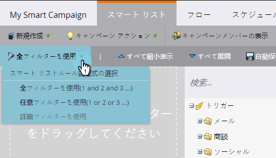
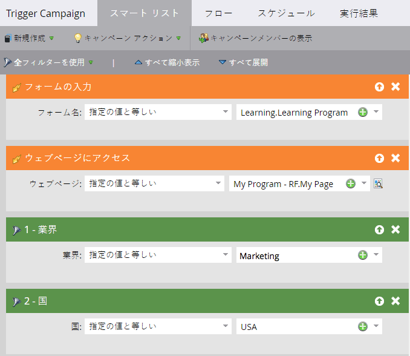

# 標準スマート・リスト・ルール・ロジックの使用 {#using-standard-smart-list-rule-logic}

キャンペーンのスマートリストを構築する際に、「フィルターを使用」オプションが表示されている可能性があります。 この設定を使用すると、フィルターをANDまたはOR演算子で評価する必要があるかどうかを判断できます。

>[!NOTE]
>
>**FYI**
>
>Marketoは現在、すべての購読で言語を標準化しているので、購読およびdocs.marketo.comの人物/人物にリード/リードを表示できます。 これらの用語は同じことを意味し、記事の説明には影響しません。 他にも変化がある。 [詳細情報](http://docs.marketo.com/display/DOCS/Updates+to+Marketo+Terminology)。

>[!NOTE]
>
>スマートリストルールロジックの変更は、フィルターにのみ適用され、トリガー **には適用されません** 。

上記の設定がALLに設定されている場合でも、トリガーは常にORとして評価されます。  次に例を示します。

上記のスマートリスト（単語）:`<pre data-theme="Confluence">IF person fills out My Form OR IF person visits My Page AND Industry is Marketing AND Country is USA THEN follow the campaign's flow step(s)</pre>` したがって、ユーザーがフォームに入力した **** かページを訪問した場合、キャンペーンは、使用した設定に応じて、後続のフィルターの**all **or **any **に基づいてそのユーザーを評価します。

>[!MORELIKETHIS]
>
>* [高度なスマートリスト・ルール・ロジックの使用](../../../../product-docs/core-marketo-concepts/smart-lists-and-static-lists/using-smart-lists/using-advanced-smart-list-rule-logic.md)

>

