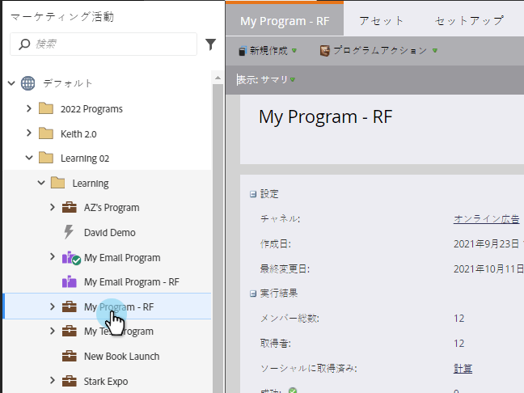
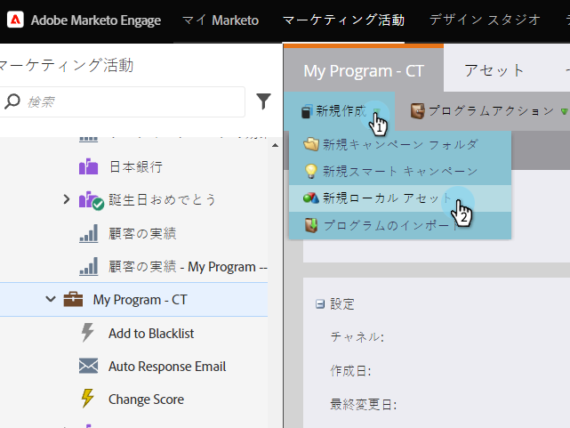
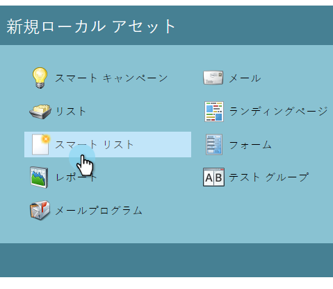
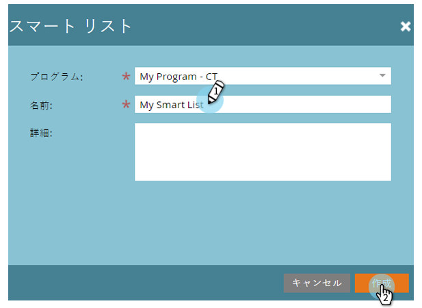

# スマートリストの作成{#create-a-smart-list}

スマートリストを使用すると、単純なフィルターを使用して特定のグループの人を検索できます。 作り方を次に示します。

1. **マーケティングアクティビティ**&#x200B;に移動します。

   

1. スマートリストを作成するプログラムを選択します。

   

1. 「**新規**」で、「**新規ローカルアセット**」をクリックします。

   

1. 「**スマートリスト**」を選択します。

   

1. **名前**&#x200B;を入力し、**作成**&#x200B;をクリックします。

   

   お疲れさまでした！ 次に、フィルターを追加して定義します。

   >[!MORELIKETHIS]
   >
   >[スマート・リストの検索と追加フィルター](/help/marketo/product-docs/core-marketo-concepts/smart-lists-and-static-lists/creating-a-smart-list/find-and-add-filters-to-a-smart-list.md)
