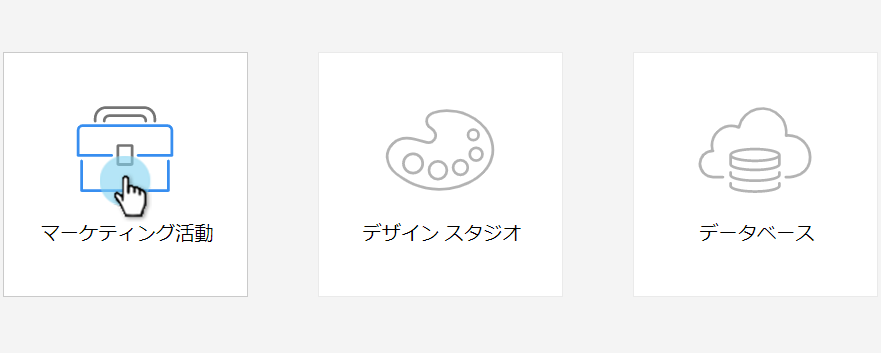
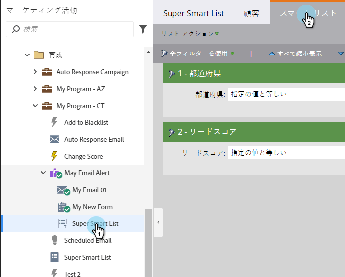
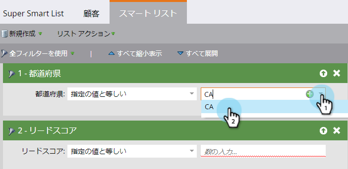
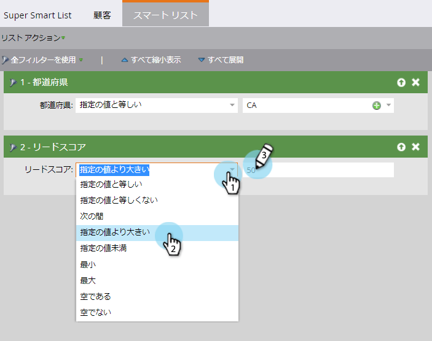

# スマートリストフィルターの定義 {#define-smart-list-filters}

>[!PREREQUISITES]
>
>* [スマートリストの作成](create-a-smart-list.md)
>* [スマート・リストの検索と追加フィルター](find-and-add-filters-to-a-smart-list.md)

>

スマートリストを [作成し、フィルターを](create-a-smart-list.md) 追加しました  。次に、フィルターを定義します。 これが方法です。

この例では、カリフォルニア州の全人口が50件を超えるスコアを持つ人々を見つけるために、これらのフィルターを定義します。

1. 「 **マーケティングアクティビティ**」に移動します。

   

1. スマートリストを選択し、「 **スマートリスト** 」タブをクリックします。

   

1. [ **状態** ]フィルタの[ **CA** ]を探して選択します。

   

   >[!NOTE]
   >
   >**Reminder**
   >
   >
   >カ **リフォルニア** と **CAの両方を保存している可能性があります**。 両方の値をフィルターし、カリフォルニア州の*すべての*人を含めるには、スマートリストフィルターに複数の値を [追加する方法を学びます](../../../../product-docs/core-marketo-concepts/smart-lists-and-static-lists/using-smart-lists/add-multiple-values-to-a-smart-list-filter.md)。

1. 「 **次より** 大きい **」演算子を選択し、「50」と入力します**。

   

   おめでとう！ これで、スマートリストを作成し、フィルターを追加/定義する方法を理解できました。

>[!NOTE]
>
>**ディープダイブ**
>
>ス [マートリストと静的リストについて詳しく説明します](http://docs.marketo.com/display/docs/smart+lists+and+static+lists)。

