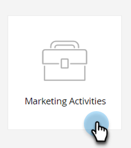

# スマートリストフィルターの定義 {#define-smart-list-filters}

>[!PREREQUISITES]
>
>* [スマートリストの作成](/help/marketo/product-docs/core-marketo-concepts/smart-lists-and-static-lists/creating-a-smart-list/create-a-smart-list.md){target="_blank"}
>* [フィルターを検索してスマートリストに追加する](/help/marketo/product-docs/core-marketo-concepts/smart-lists-and-static-lists/creating-a-smart-list/find-and-add-filters-to-a-smart-list.md){target="_blank"}

[スマートリストを作成](/help/marketo/product-docs/core-marketo-concepts/smart-lists-and-static-lists/creating-a-smart-list/create-a-smart-list.md){target="_blank"}し、[フィルターを追加](/help/marketo/product-docs/core-marketo-concepts/smart-lists-and-static-lists/creating-a-smart-list/find-and-add-filters-to-a-smart-list.md){target="_blank"}できたので、フィルターを定義しましょう。手順は次のとおりです。

この例では、次のフィルターを定義して、カリフォルニア州在住で、スコアが 50 を超える人をすべて検索します。

1. 「**[!UICONTROL マーケティングアクティビティ]**」に移動します。

   

1. 目的のスマートリストを選択し、「**[!UICONTROL スマートリスト]**」タブをクリックします。

   

1. 「**[!UICONTROL 州]**」フィルターから「CA」を検索して選択します。

   

   >[!NOTE]
   >
   >「カリフォルニア」および「CA」の両方が保存されている可能性があります。両方の値に対してフィルターを適用して、カリフォルニア州在住の人を&#x200B;_すべて_&#x200B;含めるには、[スマートリストフィルターへの複数値の追加](/help/marketo/product-docs/core-marketo-concepts/smart-lists-and-static-lists/using-smart-lists/add-multiple-values-to-a-smart-list-filter.md){target="_blank"}を参照してください。

1. **[!UICONTROL 指定の値より大きい]**&#x200B;演算子を選び、「50」と入力します。

   

>[!TIP]
>
>不完全なメールアドレス（例：「@adobe.com」のみ）を含むレコードがデータベースに存在する可能性がある場合は、「次を含む」演算子を使用する際に、2 つのメールアドレスフィルターを使用します。1 つは「@adobe.com を含む」フィルターで、もう 1 つは「adobe.com を含む」（@記号は除く）フィルターです。

これで、スマートリストを作成し、フィルターを追加／定義する方法がわかりました。
