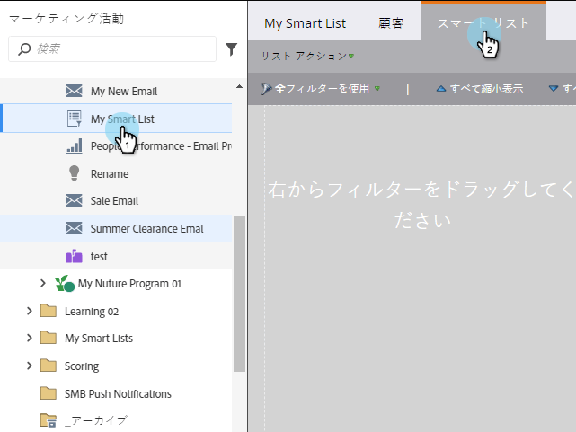
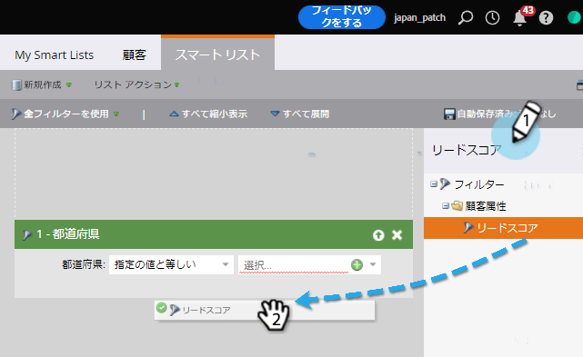

# スマート・リストの検索と追加フィルター {#find-and-add-filters-to-a-smart-list}

スマートリストを [作成したら](create-a-smart-list.md)、フィルターを追加して [定義する必要があります](define-smart-list-filters.md) 。 フィルターを検索して追加する方法を次に示します。

この例では、カリフォルニア州の50件を超えるスコアを持つすべての人を見つけます。

>[!TIP]
>
>右側のツリーを確認：フィルターは非常に強力で、様々な機能を備えています。

1. 「 **マーケティングアクティビティ**」に移動します。

   

1. フィルターの追加先のスマートリストを選択し、「 **スマートリスト** 」タブをクリックします。

   

1. [ **状態** ]フィルタを探してキャンバスにドラッグします。

   

1. また、 **スコア** ・フィルタを見つけてドラッグします。

   

完璧！ 次に、これらのフィルターを定義します。

>[!MORELIKETHIS]
>
>* [スマートリストの作成](create-a-smart-list.md)
>* [スマートリストフィルターの定義](define-smart-list-filters.md)

>

