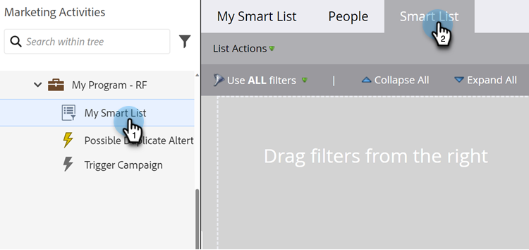

# フィルターを検索してスマートリストに追加 {#find-and-add-filters-to-a-smart-list}

[&#x200B; スマートリストを作成した後](/help/marketo/product-docs/core-marketo-concepts/smart-lists-and-static-lists/creating-a-smart-list/create-a-smart-list.md){target="_blank"}、フィルターを追加して[定義](/help/marketo/product-docs/core-marketo-concepts/smart-lists-and-static-lists/creating-a-smart-list/define-smart-list-filters.md){target="_blank"}する必要があります。

この例では、目標はスコアが50を超えるカリフォルニアのすべての人物を見つけることです。

>[!TIP]
>
>右側のツリーを確認してください。フィルターは非常に強力で、様々な機能があります。

1. **[!UICONTROL マーケティングアクティビティ]**&#x200B;に移動します。

   

1. フィルターを追加するスマートリストを選択し、「**[!UICONTROL スマートリスト]**」タブをクリックします。

   

1. 「**[!UICONTROL 州]**」フィルターを探してキャンバスにドラッグします。

   

1. また、「**[!UICONTROL スコア]**」フィルターも探してドラッグします。

   

これらのフィルターを定義します。

>[!MORELIKETHIS]
>
>* [スマートリストの作成](/help/marketo/product-docs/core-marketo-concepts/smart-lists-and-static-lists/creating-a-smart-list/create-a-smart-list.md){target="_blank"}
>* [スマートリストフィルターの定義](/help/marketo/product-docs/core-marketo-concepts/smart-lists-and-static-lists/creating-a-smart-list/define-smart-list-filters.md){target="_blank"}
