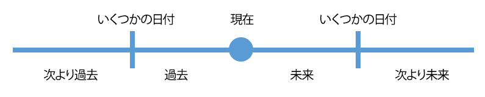

# スマートリストフィルタ演算子用語集{#smart-list-filter-operators-glossary}

演算子は、[スマートリスト](http://docs.marketo.com/display/docs/smart+lists+and+static+lists)の一部で、特定の情報を得るのに役立ちます。 フィルターやトリガーを分かりやすい言語で記述できます。 使用できる演算子は、フィールドのタイプによって異なります。\
各演算子を説明する用語集を次に示します。

## 日付フィールド{#date-fields}

演算子を選択すると、右側が動的に変更されます。

| 演算子 | 右側 | 説明 |
|---|---|---|
| is | 単一の日付 | 完全一致の日付 |
| が次の値でない | 単一の日付 | 指定した日付以外の日付 |
| betwee | 2つの日付フィールド | 指定した2つの日付間を含む任意の日付 |
| 過去に | 自然言語入力* | 次の図を参照してください。 |
| 以前は | 自然言語入力* | 次の図を参照してください。 |
| 将来 | 自然言語入力* | 次の図を参照してください。 |
| 後に | 自然言語入力* | 次の図を参照してください。 |
| 時間枠内に | プリセット（前四半期、昨日など） | 選択リストで定義 |
| after | 単一の日付 | 指定した日付以降のすべてのレコード |
| before | 単一の日付 | 指定したレコードより前のすべてのレコード |
| onまたはafter | 単一の日付 | 「後」と同じで両端を含む |
| 以前 | 単一の日付 | 「前」と同じで「後」を含む |
| が空である | なし | 日付のないすべてのレコード |
| が空でない | なし | 任意の日付を持つすべてのレコード |

*自然言語入力はかっこいい。 入力できるパターンの例を次に示します。

* 1時間
* 八二日
* 3週間
* 14か月
* 1 year

数と単位を一緒に入力すれば動く！

>[!NOTE]
>
>以前は&#x200B;**does**&#x200B;に、スマートリストを作成する日を（その後ではなく、その時刻まで）含めていました。

>[!CAUTION]
>
>日付フィールドフィルタ（生年月日、SFDC作成日など）を使用してスマートリストを作成し、**または**&#x200B;の前または&#x200B;**の前に**&#x200B;を使用すると、スマートリストには、その日付フィールドに値を持たない人も含まれます。

次の図を使用して、日付演算子の違いを理解します。

>[!NOTE]
>
>**例**
>
>過去と将来のイベントを扱う場合は、日付フィールドが扱いにくい場合があります。 次に例を示します。
>
>**以前は**
>
>新しいプロモーションの場合、この演算子を使用して、1年以内にサービスを購読または更新していない、または購読したことのないユーザーにのみ電子メールを送信します。
>
>**今後**
>
>90日後に更新を受けるお客様に会いたいとします。 2つの異なるフィルターを使用します。 最初に「90日後に」を、次に「91日後に」を使用します。 90日後の日付を持つ人は誰でも捕らえられる。

## 文字列フィールド{#string-fields}

| 演算子 | 説明 |
|---|---|
| is | 完全一致（大文字と小文字は区別されません） |
| が次の値でない | 完全一致以外のすべて |
| 開始 | 文字列の最初の一致文字 |
| ～との開始ではない | 文字列の最初の文字が一致しない |
| 次を含む | 文字列内に含まれるすべての文字が一致する(例：カリフォルニア、運、その他) |
| 次を含まない | 一致する文字列内の文字が一致しません。 （「次を含む」の逆） |
| が空である | 値のないレコード(NULL) |
| が空でない | ANY値を持つレコード |

>[!TIP]
>
>負の演算子に対しては正の値を使用します。 「異なる」フィルターは、インスタンス内のデータセット全体を検索する必要があるので、非常に時間がかかる場合があります。 ポジティブな「is」フィルターは、より効果的な検索アルゴリズムを活用できます。

## 整数フィールド{#integer-fields}

<table> 
 <thead> 
  <tr> 
   <th colspan="1" rowspan="1">演算子</th> 
   <th colspan="1" rowspan="1">
説明
</th> 
  </tr> 
 </thead> 
 <tbody> 
  <tr> 
   <td colspan="1" rowspan="1">is</td> 
   <td colspan="1" rowspan="1">完全一致（= 0は、0 <em>と</em> NULLの両方のリードを返します）</td> 
  </tr> 
  <tr> 
   <td colspan="1" rowspan="1">が次の値でない</td> 
   <td colspan="1" rowspan="1">数値が完全一致以外のすべて</td> 
  </tr> 
  <tr> 
   <td colspan="1" rowspan="1">betwee</td> 
   <td colspan="1" rowspan="1">2つの値を定義して、次の範囲内の全員を見つけます（両方を含む）</td> 
  </tr> 
  <tr> 
   <td colspan="1" rowspan="1">より大きい</td> 
   <td colspan="1" rowspan="1">指定した</td> 
  </tr> 
  <tr> 
   <td colspan="1" rowspan="1">より小さい</td> 
   <td colspan="1" rowspan="1">指定未満</td> 
  </tr> 
  <tr> 
   <td colspan="1" rowspan="1">少なくとも</td> 
   <td colspan="1" rowspan="1">指定した値（この値を含む）より上</td> 
  </tr> 
  <tr> 
   <td colspan="1" rowspan="1">せいぜい</td> 
   <td colspan="1" rowspan="1">指定未満（両端を含む）</td> 
  </tr> 
  <tr> 
   <td colspan="1" rowspan="1">が空である</td> 
   <td colspan="1" rowspan="1">値(NULL)のないレコード — ゼロは数値、<em></em> NULLではない&lt;a0/&gt;</td> 
  </tr> 
  <tr> 
   <td colspan="1" rowspan="1">が空でない</td> 
   <td colspan="1" rowspan="1">任意の値（0を含む）を持つレコード</td> 
  </tr> 
 </tbody> 
</table>

ご覧の通り、これらの演算子を使うと、マーケットの人を流暢に話すことができます。
