# 追加ブロックリスト対象 {#add-person-to-blocklist}

ユーザーをブロックリストに追加すると、そのユーザーは通信を受信できなくなります。

>[!NOTE]
>
>マーケティング担当者は、ブラックリストやホワイトリストなどの用語を、当社の製品のブロックリスト許可リストやに変更する過程にあります。 この更新中、UIとドキュメントのスクリーンショットには古い用語が表示され、ドキュメントのテキストには新しい用語が表示される場合があります。 ご混乱をおかけして申し訳ございません。

1. [新しいデフォルトプログラムを作成し](../../../../product-docs/core-marketo-concepts/programs/creating-programs/create-a-program.md) 、追加ブロックリスト ****&#x200B;に名前を付けます。
1. 「 **新規** 」をクリックし、「 **新規ローカルアセット**」を選択します。

   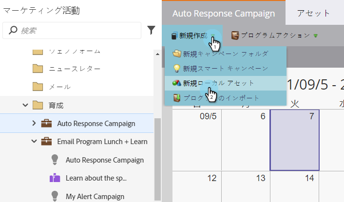

1. リストに名前を付け、「 **作成**」をクリックします。

   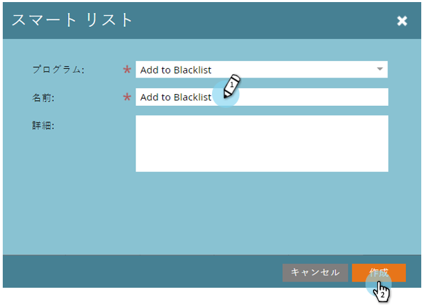

1. リスト追加に追加する **** スマートに対するすべてのユーザーブロックリスト。

   >[!NOTE]
   >
   >お使いのブロックリストのユーザーは、操作用の電子メールを受信しません。

   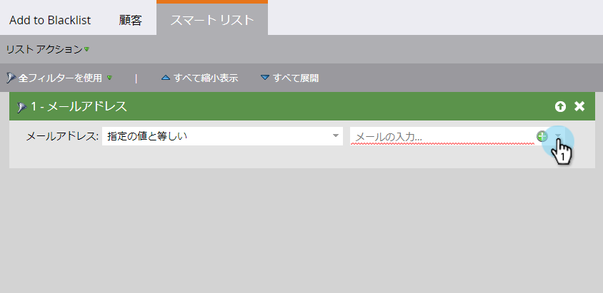

1. 「 **新規** 」をクリックし、「 **新規スマートキャンペーン**」を選択します。

   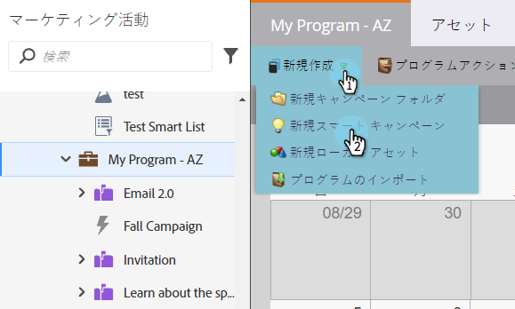

1. 「 **新しいスマートキャンペーン**」に名前を付けます。 「 **作成**」をクリックします。

   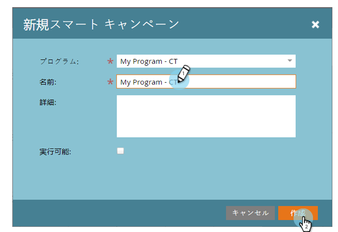

1. 「 **Member of Smart」リストをドラッグ・アンド・ドロップします**。

   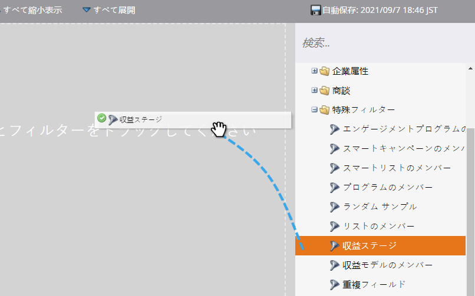

1. 作成したスマートリストを選択します。

   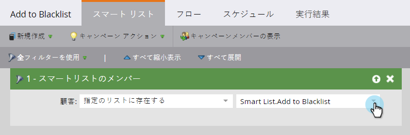

1. 「データ値を **変更**」をドラッグ&amp;ドロップします。

   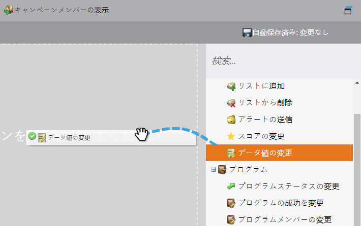

1. 「 **フロー****」で、「** 属性」に「ブロック・リスト」と入力し、「新しい値」を「true」に設定し **ま**********&#x200B;す。

   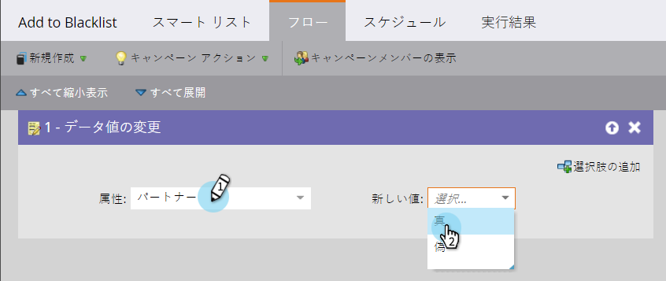

1. 「 **スケジュール** 」タブで、「1回 **実行**」を選択します。

   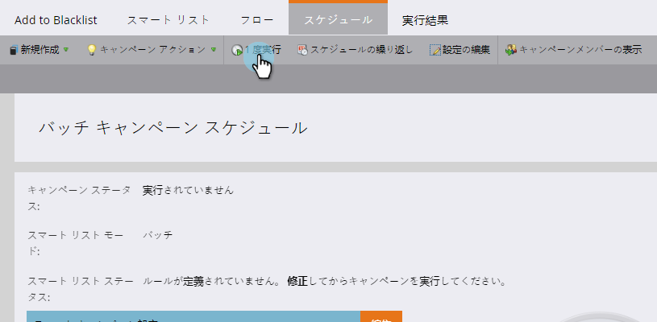

1. 「 **今すぐ実行** 」を選択し、「 **実行**」をクリックします。

   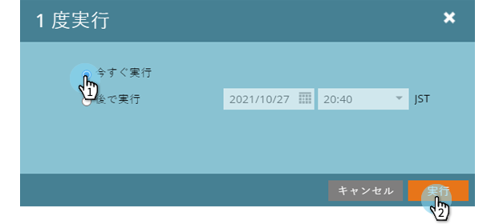

   やった！ これらのユーザーは、電子メールを受信しなくなります。

   >[!TIP]
   >
   >「 [Change Data Value](../../../../product-docs/core-marketo-concepts/smart-campaigns/creating-a-smart-campaign/create-a-new-smart-campaign.md) with **Block Listed」がtrueの場合、****** トリガースマートキャンペーンを作成します。これは、将来、可能な属性を持つすブロックリストべての人に対して適用されます。

