# リードをブロックリストに追加 {#add-person-to-blocklist}

リードをブロックリストに追加すると、コンテンツを気に入ってくれた有望な人だけにコンテンツを読んでもらえるようになります。

1. 新しい[&#x200B; デフォルトプログラム &#x200B;](/help/marketo/product-docs/core-marketo-concepts/programs/creating-programs/create-a-program.md){target="_blank"}を作成し、「Add to ブロックリスト」という名前を付けます。

1. 「**[!UICONTROL 新規作成]**」をクリックして、「**[!UICONTROL 新規ローカルアセット]**」を選択します。

   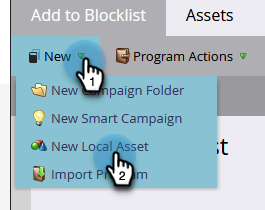

1. 「**[!UICONTROL スマートリスト]**」を選択します。

   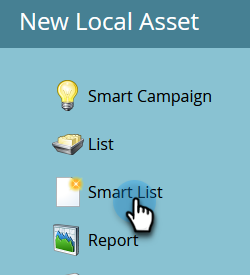

1. リストに名前を付け、「**[!UICONTROL 作成]**」をクリックします。

   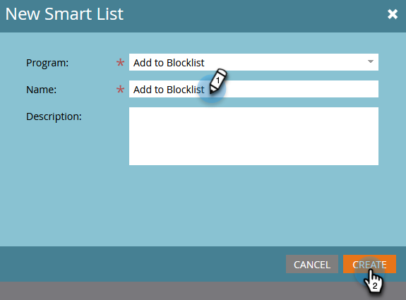

1. スマートブロックリストに追加するスマートリストにすべての人物を追加します。

   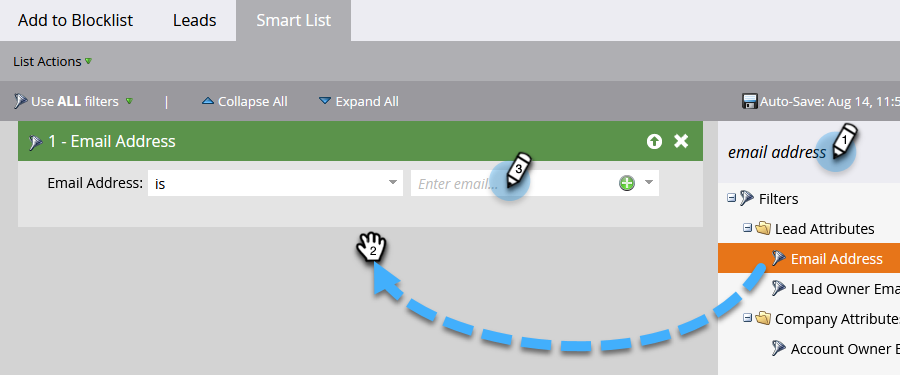

   >[!NOTE]
   >
   >ブロックリストに加えられたリードには、オペレーショナルメールが送信されません。

1. プログラムに戻ります。

   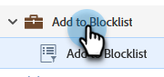

1. 「**[!UICONTROL 新規作成]**」をクリックして、「**[!UICONTROL 新規スマートキャンペーン]**」を選択します。

   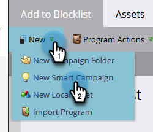

1. 新しいスマートキャンペーンに名前を付けます。 「**[!UICONTROL 作成]**」をクリックします。

   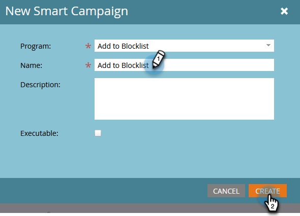

1. 「**[!UICONTROL スマートリストのメンバー]**」をドラッグ＆ドロップします。

   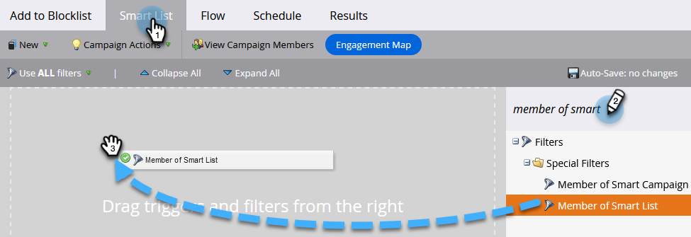

1. 作成したスマートリストを選択します。

   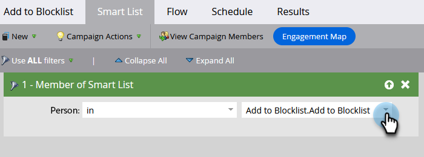

1. 「**[!UICONTROL フロー]**」タブをクリックします。 「**[!UICONTROL データ値を変更]**」フローアクションをドラッグ&amp;ドロップします。

   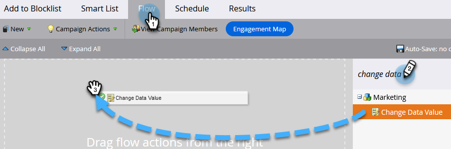

1. **[!UICONTROL 属性]** ドロップダウンで、「**[!UICONTROL リストされているブロック]**」を選択し、**[!UICONTROL 新しい値]**&#x200B;を&#x200B;**[!UICONTROL true]**&#x200B;に設定します。

   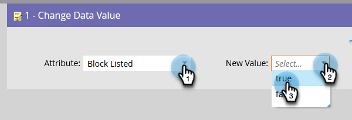

1. 「**[!UICONTROL スケジュール]**」タブをクリックし、**[!UICONTROL 1回実行]**&#x200B;を選択します。

   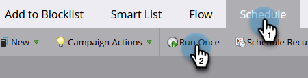

1. 「**[!UICONTROL 今すぐ実行]**」を選択し、「**[!UICONTROL 実行]**」をクリックします。

   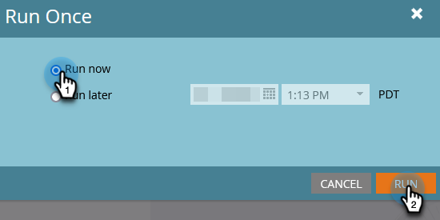

1. 「**[!UICONTROL 実行]**」をもう一度クリックします。

   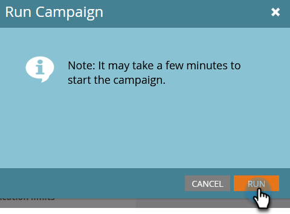

これらのユーザーにはメールが送信されません。

>[!TIP]
>
>**Change Data Value**&#x200B;を使用して[トリガーキャンペーン &#x200B;](/help/marketo/product-docs/core-marketo-concepts/smart-campaigns/creating-a-smart-campaign/create-a-new-smart-campaign.md){target="_blank"}を作成し、**Block Listed is true**&#x200B;を指定して、個のセグメントを作成できます。これは、将来作成できる属性を持つすべてのユーザーに対して適用されます。
