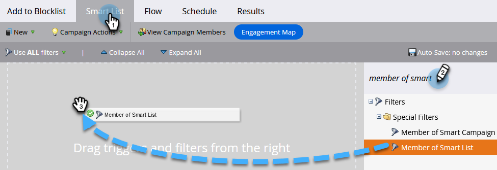

# リードをブロックリストに追加 {#add-person-to-blocklist}

リードをブロックリストに追加すると、コンテンツを気に入ってくれた有望な人だけにコンテンツを読んでもらえるようになります。

1. [新しいデフォルトプログラムを作成](/help/marketo/product-docs/core-marketo-concepts/programs/creating-programs/create-a-program.md)し、「**ブロックリストに追加**」と名前を付けます。

1. 「**新規作成**」をクリックして、「**新規ローカルアセット**」を選択します。

   

1. 「**スマートリスト**」を選択します。

   

1. リストに名前を付け、「**作成**」をクリックします。

   

1. ブロックリストに追加するリードをすべて「**スマートリスト**」に追加します。

   

   >[!NOTE]
   >
   >ブロックリストに加えられたリードには、オペレーショナルメールが送信されません。

1. プログラムに戻ります。

   

1. 「**新規作成**」をクリックして、「**新規スマートキャンペーン**」を選択します。

   

1. **新しいスマートキャンペーン**&#x200B;の名前を指定します。「**作成**」をクリックします。

   

1. 「**スマートリストのメンバー**」をドラッグ＆ドロップします。

   

1. 先ほど作成したスマートリストを選択します。

   

1. 「**フロー**」タブをクリックします。次をドラッグ&amp;ドロップ： **データ値の変更** フローアクション。

   

1. Adobe Analytics の **属性** ドロップダウン選択 **ブロックリスト登録済み** と設定します。 **新しい値** から **true**.

   

1. 次をクリック： **スケジュール** 「 」タブで「 」を選択します。 **1 回実行**.

   

1. 「**今すぐ実行**」を選択し、「**実行**」をクリックします。

   

1. クリック **実行** 再び

   

これらのユーザーにはメールが送信されません。

>[!TIP]
>
>[データ値を変更](/help/marketo/product-docs/core-marketo-concepts/smart-campaigns/creating-a-smart-campaign/create-a-new-smart-campaign.md)を使用して、**ブロックリストに追加済みを true** に設定し、将来的にブロックリストに加わる可能性のある属性を持つすべてのユーザーに対して、**トリガースマートキャンペーン**&#x200B;を作成します。
