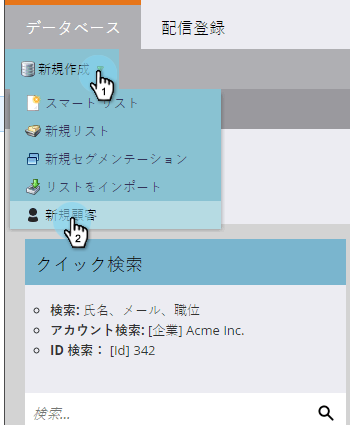

# リードの手動作成 {#create-a-person-manually}

リードを Marketo に入れる方法はいろいろあります。手動で作成する必要がある場合は、次の手順に従います。

>[!CAUTION]
>
>Marketo **not** は、絵文字を含む電子メールアドレスをサポートします。

1. **データベース**&#x200B;に移動します。

   

1. 「**新規作成**」で「**新規リード**」をクリックします。

   

1. リードの情報を入力し、「**作成**」をクリックします。

   

Marketo に 1 件のリードを追加するには、この方法が手早く簡単です。
