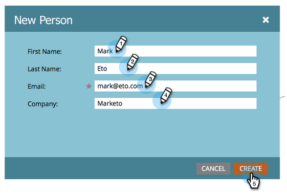

# 手動による人物の作成 {#create-a-person-manually}

Adobe Marketo Engage に人物を追加する方法はいくつかあります。 手動で作成するには、次の手順に従います。

>[!CAUTION]
>
>Marketo は、絵文字を含むメールアドレスをサポートしていません。

1. 「**[!UICONTROL データベース]**」に移動します。

   

1. 「**[!UICONTROL 新規作成]**」で「**[!UICONTROL 新規リード]**」をクリックします。

   

1. リードの情報を入力し、「**[!UICONTROL 作成]**」をクリックします。

   
