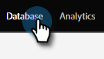

# データベースダッシュボード {#database-dashboard}

データベースダッシュボードは、ワークスペース内のユーザーに関する主要な属性を素早く特定するのに役立つスナップショットとして機能します。

>[!NOTE]
>
>* データベースダッシュボードは、24～32 時間ごとに自動的に更新されます。 画面右側の「最終更新」テキストをクリックすると、いつでも手動更新を実行できます。
>
>* 各ワークスペースには、独自のデータベースダッシュボードがあります。

そこに到達するには、マイ Marketo から「**[!UICONTROL データベース]**」を選択します。

グラフには、人物の合計数、市場対象となる人物の数、上位 5 件の人物獲得ソースが表示されます。 詳しくは、緑色の領域にポインタを合わせてください。

>[!TIP]
>
>詳細な情報やタイムリーな情報については、[人物パフォーマンスレポート &#x200B;](/help/marketo/product-docs/reporting/basic-reporting/report-types/people-performance-report.md){target="_blank"}をお試しください。

**人物の合計：**&#x200B;リストされているワークスペースの常時の人物の数。

**マーケティング可能な人物：**&#x200B;リストされているワークスペースの常時の人物の数&#x200B;_から次を差し引いた数_：メールアドレスのない人物、メールがハードバウンスした人物、ブロックリスト登録済みの人物、登録解除した人物、現在「マーケティングを中断した人物」に設定されている人物。
