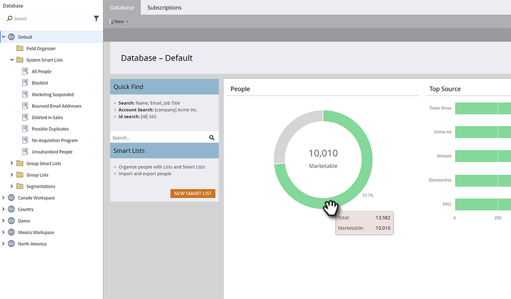

# データベースダッシュボード {#database-dashboard}

データベースダッシュボードは、ワークスペース内のユーザーに関する主要な属性を素早く特定するのに役立つスナップショットとして機能します。

>[!NOTE]
>
>各ワークスペースには、独自のデータベースダッシュボードがあります。

そこに移動するには、「 」を選択します。 **データベース** 私のMarketoから

グラフは、人物の総数、マーケティング可能な人物の数、上位 5 つの人物獲得ソースを示します。緑の領域の上にマウスポインターを置くと、詳細が表示されます。

>[!TIP]
>
>人物に関するより具体的な情報やタイムリーな情報を取得したい場合は、[人物の効果レポート](/help/marketo/product-docs/reporting/basic-reporting/report-types/people-performance-report.md)を試してみてください。

**担当者合計：** リストされたワークスペースの常勤の人数。

**市場性の高い担当者：** リストされているワークスペースの常勤の人数 _マイナス_:メールアドレスのない人、メールがハードバウンスした人、配信を停止した人、配信を停止した人、現在「マーケティングを中断した人」に設定されている人。
