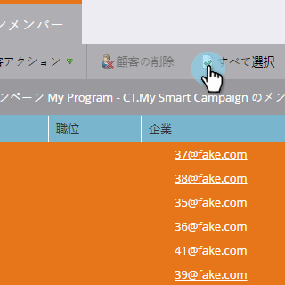
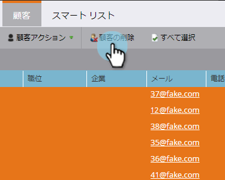
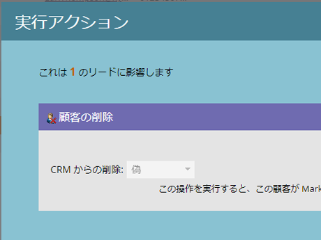

# スマートリストまたはリストのユーザーの削除 {#delete-people-in-a-smart-list-or-list}

リストまたはスマートリスト内の一部またはすべてのユーザーをすばやく簡単に削除できます。

>[!PREREQUISITES]
>
>* [スマートリストの作成](../../../../product-docs/core-marketo-concepts/smart-lists-and-static-lists/creating-a-smart-list/create-a-smart-list.md)

>

1. 「 **マーケティング** アクティビティ ****」に移動します。

   

1. 削除するすべてのユーザーが含まれるリスト/スマートリストを選択し、「 **ユーザー** 」タブに移動します。

   

   >[!CAUTION]
   >
   >ユーザーを削除すると、そのユーザーはリストから削除されるだけではなく、データベースから完全に削除されます。

1. 「す **べて選択** 」をクリックし ****&#x200B;ます。 Ctrl/Commandキーを押しながらをクリックして、いくつかのレコードを手動で選択することもできます。

   

   >[!NOTE]
   >
   >結果が複数のページにまたがる場合は、「す **べて選択** 」をクリックすると、すべてのページにまたがるすべてのユーザーが **** 選択されます。

1. Marketorからユーザーを完全に削除するには、「 **Delete** Person ****」をクリックします。

   

1. CRMから **もレコードを削除する場合は****** 、 **CRMから削除を****** trueに設定します。

   

   >[!CAUTION]
   >
   >MarketoとCRMから削除すると、どちらのシステムでも回復できなくなります。 人々とその歴史は永遠に消え去る。 後で追加すると、新しいレコードとして扱われます。

   >[!NOTE]
   >
   >マーケティング担当者がCRMに関連付けられていない場合、スクリーンショットのようにオプションは灰色表示になっています。

1. 「 **今すぐ** 実行 **」をクリックします**。

   

1. 50人を超える人を削除すると、この画面が表示されます。 削除するユーザーの数を入力し、[元に戻す **ことができません** ]ボックスをオンにして、[ **削除**]をクリックします。

   

   >[!NOTE]
   >
   >一括削除の結果を表示するには、画面の右上隅にある「単一フローアクション」(Single Flow Action)ポップアップボックスの「 **表示結果** 」(Results)をクリックします。 削除時間は、複数の要因によって大きく異なります。

   これは素晴らしい機能です。使用する際は細心の注意を払ってください。

