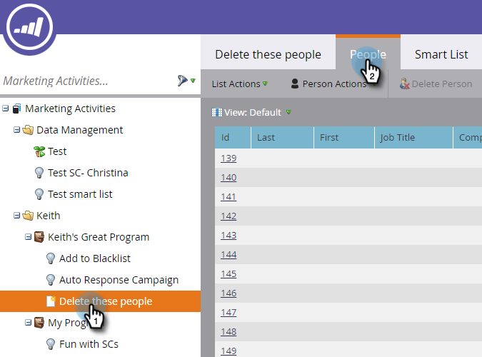
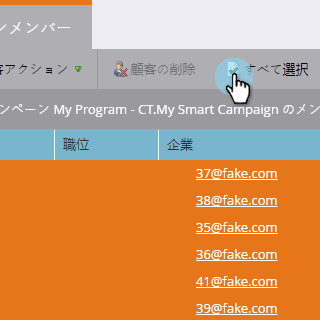
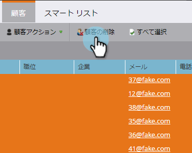
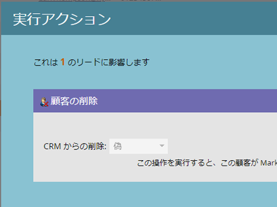
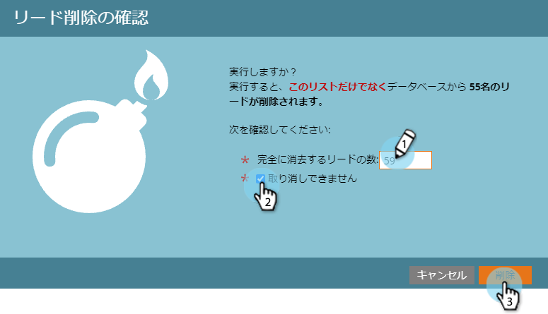

# スマートリストまたはリストの人物の削除 {#delete-people-in-a-smart-list-or-list}

リストまたはスマートリスト内の一部またはすべてのユーザーを削除できます。

>[!PREREQUISITES]
>
>[スマートリストの作成](/help/marketo/product-docs/core-marketo-concepts/smart-lists-and-static-lists/creating-a-smart-list/create-a-smart-list.md)

1. **[!UICONTROL マーケティングアクティビティ]**&#x200B;に移動します。

   

1. 削除するすべてのユーザーを含むリスト/スマートリストを選択し、**[!UICONTROL ユーザー]** タブに移動します。

   

   >[!CAUTION]
   >
   >人物を削除すると、リストからその人物を削除するだけでなく、データベースから完全に削除されます。

1. 「**[!UICONTROL すべてを選択]**」をクリックします。 Ctrl／Cmd キーを押しながらクリックして、いくつかのレコードを手動で選択することもできます。

   

   >[!NOTE]
   >
   >結果が複数のページにまたがる場合は、「**[!UICONTROL すべてを選択]**」をクリックすると、すべてのページのすべての人物が選択されます。

1. ユーザーを Marketo から完全に削除するには、「**[!UICONTROL 人物を削除]**」をクリックします。

   

1. CRM からもレコードを削除する場合は、「**[!UICONTROL CRM から削除]**」を **[!UICONTROL true]** に設定します。

   

   >[!CAUTION]
   >
   >Marketo と CRM から削除すると、どちらのシステムでも復元できなくなります。 人物とその履歴は完全に消去されます。 後で追加した場合は、新しいレコードとして扱われます。

   >[!NOTE]
   >
   >Marketo が CRM に結び付けられていない場合、スクリーンショットのようにオプションがグレー表示されます。

1. 「**[!UICONTROL 今すぐ実行]**」をクリックします。

   

1. 50 名を超える人物を削除すると、この画面が表示されます。 削除するユーザーの数を入力し、**[!UICONTROL 取り消しできない]** ボックスにチェックを入れ、**[!UICONTROL 削除]**&#x200B;をクリックします。

   

   >[!NOTE]
   >
   >一括削除の結果を表示するには、画面の右上隅にある「単一フローアクション」ポップアップボックスの「**[!UICONTROL 結果を表示]**」をクリックします。 削除時間は、複数の要因によって大きく異なる場合があります。

   この機能は慎重に使用してください。
