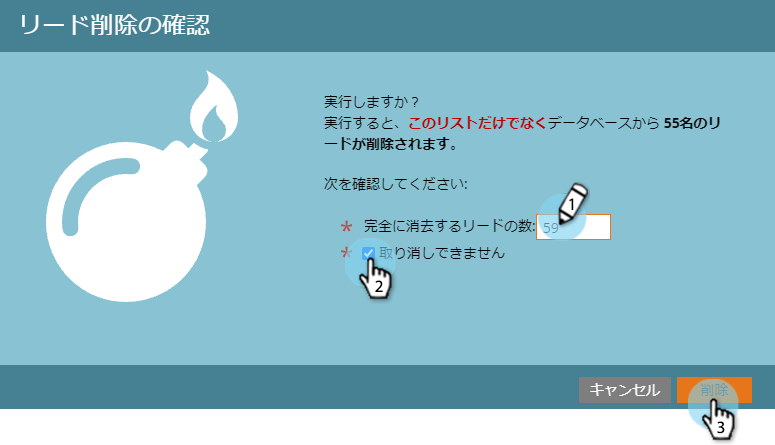

# スマートリストまたはリストのユーザーの削除{#delete-people-in-a-smart-list-or-list}

リストまたはスマートリスト内の一部またはすべてのユーザーをすばやく簡単に削除できます。

>[!PREREQUISITES]
>
>* [スマートリストの作成](../../../../product-docs/core-marketo-concepts/smart-lists-and-static-lists/creating-a-smart-list/create-a-smart-list.md)

>

1. **マーケティング** **アクティビティ**&#x200B;に移動します。

   

1. 削除するすべてのユーザーを含むリスト/スマートリストを選択し、「**ユーザー**」タブに移動します。

   

   >[!CAUTION]
   >
   >ユーザーを削除すると、そのユーザーはリストから削除されるだけではなく、データベースから完全に削除されます。

1. 「******すべて**&#x200B;を選択」をクリックします。 Ctrl/Commandキーを押しながらをクリックして、いくつかのレコードを手動で選択することもできます。

   

   >[!NOTE]
   >
   >結果が複数のページにまたがる場合は、「******すべて**&#x200B;を選択」をクリックすると、すべてのページのすべてのユーザーが選択されます。

1. マーケットからユーザーを完全に削除するには、「**削除** **人物**」をクリックします。

   

1. CRMからもレコードを削除する場合は、**Remove** **from** **CRM**&#x200B;を&#x200B;**true**&#x200B;に設定します。

   

   >[!CAUTION]
   >
   >MarketoとCRMから削除すると、どちらのシステムでも回復できなくなります。 人々とその歴史は永遠に消え去る。 後で追加すると、新しいレコードとして扱われます。

   >[!NOTE]
   >
   >マーケティング担当者がCRMに関連付けられていない場合、スクリーンショットのようにオプションは灰色表示になっています。

1. 「**実行** **今すぐ**」をクリックします。

   

1. 50人を超える人を削除すると、この画面が表示されます。 削除するユーザーの数を入力し、[**元に戻せません**]ボックスをオンにして、[**削除**]をクリックします。

   

   >[!NOTE]
   >
   >一括削除の結果を表示するには、画面の右上隅にある「単一フローアクション」ポップアップボックスで「**表示結果**」をクリックします。 削除時間は、複数の要因によって大きく異なります。

   これは素晴らしい機能です。使用する際は細心の注意を払ってください。

