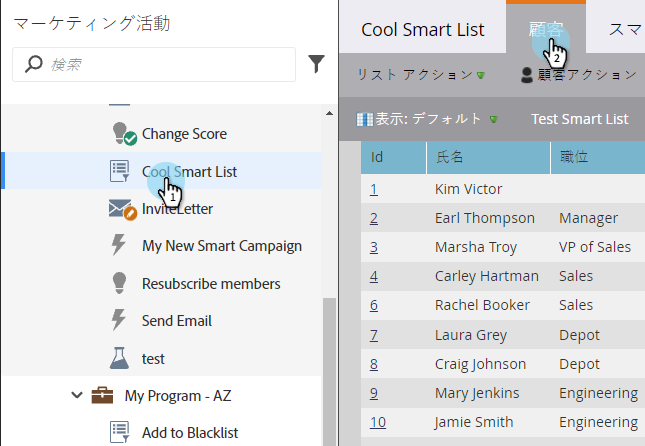
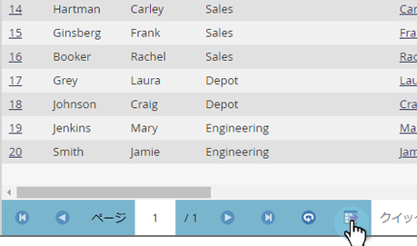
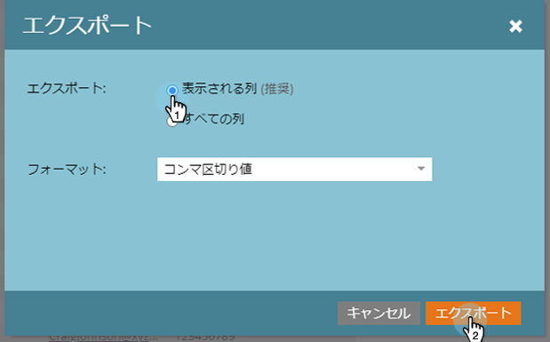
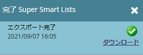

# リストまたはスマートリストからリードを Excel にエクスポート {#export-people-to-excel-from-a-list-or-smart-list}

Marketo以外でリストまたはスマートリストの結果が必要な場合は、Excelに簡単にエクスポートできます。 どうやって。

1. **マーケティングアクティビティ**&#x200B;に移動します。

   

1. 書き出すリストまたはスマートリストを選択し、「**ユーザー**」タブに移動します。

   

1. ページの下部にあるExcelアイコンをクリックします。

   

1. 「**表示列**」を選択し、「**書き出し**」をクリックします。

   

   >[!NOTE]
   >
   >「**すべての列**」を選択した場合、エクスポートのサイズが大きくなり、生成/ダウンロードに時間がかかります。

   >[!TIP]
   >
   >エクスポート時に正しくレンダリングされない外部文字がユーザーレコードに含まれている場合は、「**フォーマット**」ドロップダウンでファイルタイプを変更してみてください。

1. エクスポートが実行されます。 完了したら、「**今すぐダウンロード**」をクリックして、ファイルを取得できます。

   

   >[!TIP]
   >
   >書き出しに時間がかかっている場合は、いつでもログアウトして、後で戻ることができます。 **「今すぐダウンロード**」リンクには、**リストアクション**&#x200B;メニューで「**書き出しステータスを表示**」を選択してアクセスでき、1週間有効です。
