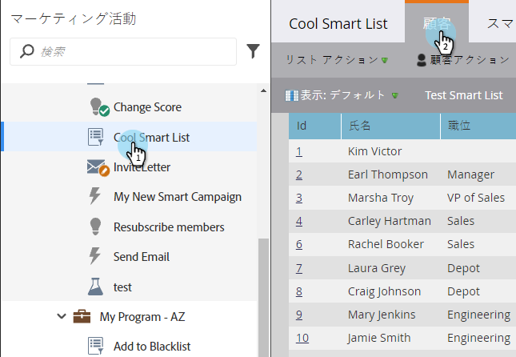
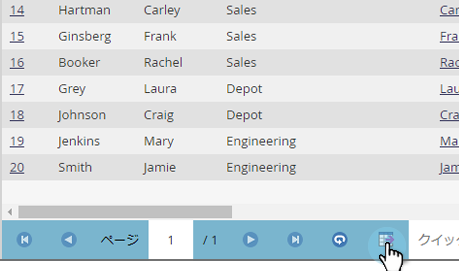
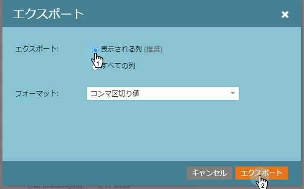
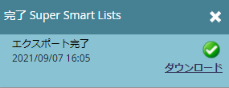

# リストまたはスマートリストから人物を Excel にエクスポート {#export-people-to-excel-from-a-list-or-smart-list}

Marketo以外でリストまたはスマートリストの結果が必要な場合は、Excelに書き出すことができます。

1. **[!UICONTROL マーケティングアクティビティ]**&#x200B;に移動します。

   

1. 書き出すリストまたはスマートリストを選択し、**[!UICONTROL ユーザー]** タブに移動します。

   

1. ページの下部にある Excel アイコンをクリックします。

   

1. **[!UICONTROL 表示される列]**&#x200B;を選択し、「**[!UICONTROL エクスポート]**」をクリックします。

   

   >[!NOTE]
   >
   >**[!UICONTROL すべての列]**&#x200B;を選択すると、エクスポートのサイズが大きくなり、生成／ダウンロードに時間がかかります。

   >[!TIP]
   >
   >ユーザーのレコードに、書き出し時に適切にレンダリングされない外国文字が含まれている場合は、**[!UICONTROL 形式]** ドロップダウンでファイルの種類を変更してみてください。

1. エクスポートが実行されます。 終了したら、「**[!UICONTROL 今すぐダウンロード]**」をクリックしてファイルを取得します。

   

   >[!TIP]
   >
   >エクスポートに時間がかかっている場合は、いつでもログアウトして、後で再度アクセスできます。 この「**[!UICONTROL 今すぐダウンロード]**」リンクには、**[!UICONTROL リストアクション]**&#x200B;メニューの「**[!UICONTROL エクスポートステータスを表示]**」からアクセスでき、リンクは 1 週間有効です。
