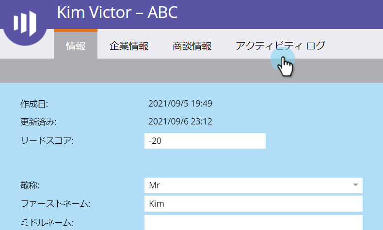
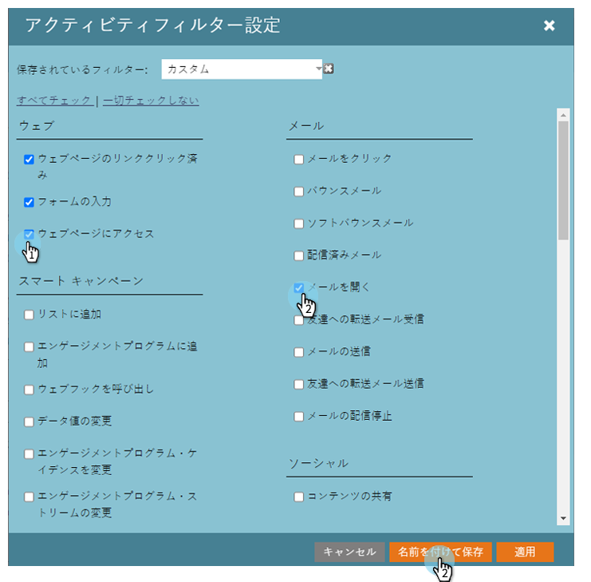
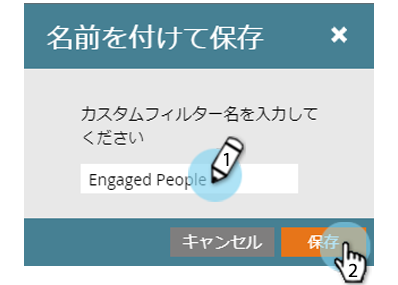
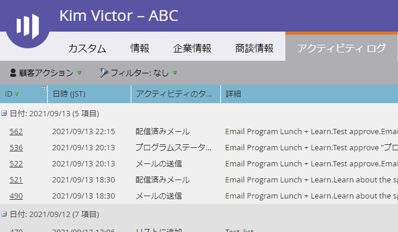
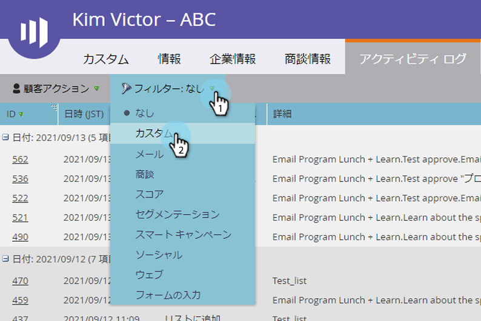
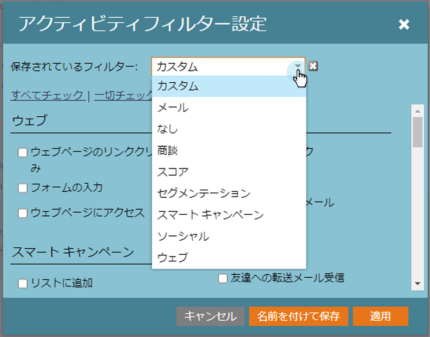

# 個人{#filter-activity-types-in-the-activity-log-of-a-person}のアクティビティログのアクティビティタイプをフィルタする

アクティビティログで、自分にとって最も重要なアクティビティを検索します。

>[!NOTE]
>
>[アクティビティログ](/help/marketo/product-docs/core-marketo-concepts/smart-lists-and-static-lists/managing-people-in-smart-lists/locate-the-activity-log-for-a-person.md)の詳細を参照してください。

1. **個人の詳細**&#x200B;ページに移動します。 「**アクティビティログ**」タブをクリックします。

   

1. **フィルター**&#x200B;ドロップダウンを選択します。

   

## カスタムフィルターの作成{#creating-custom-filters}

1. **フィルター**&#x200B;ドロップダウンをクリックします。 「**カスタム**」を選択します。

   

1. フィルタに使用するアクティビティを選択します。 「**名前を付けて保存**」をクリックします。

   

1. **カスタムフィルター名**&#x200B;を入力します。 「**保存**」をクリックします。

   

   現在は、フィルターの条件を満たす個人アクティビティのみが表示されます。

   

## 保存されたフィルターを参照{#reference-saved-filters}

保存されたフィルターには、**フィルター**&#x200B;ドロップダウンからアクセスできます。

1. **フィルター**&#x200B;ドロップダウンをクリックします。 「**カスタム**」を選択します。

   

1. 「**保存されたフィルター**」をクリックします。 保存されたフィルターを次に示します。

   
