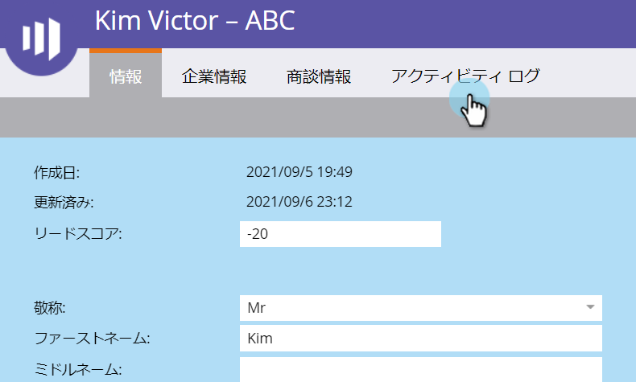
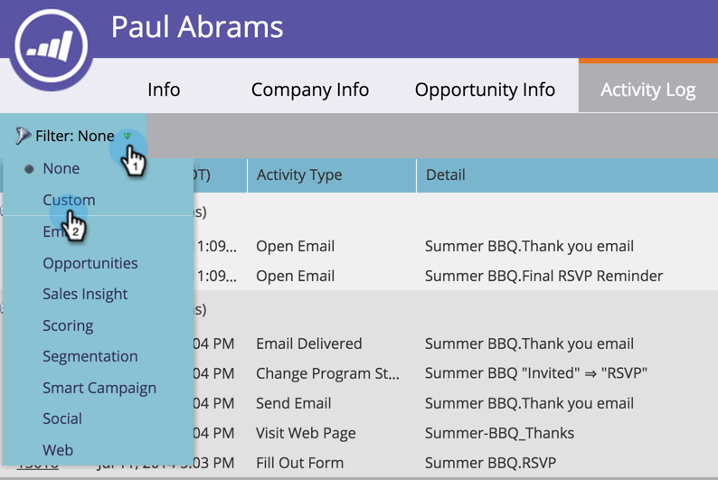
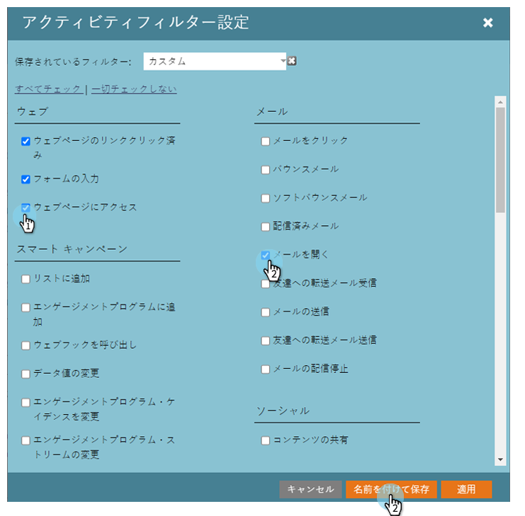
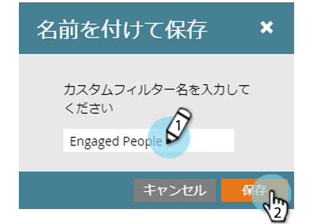
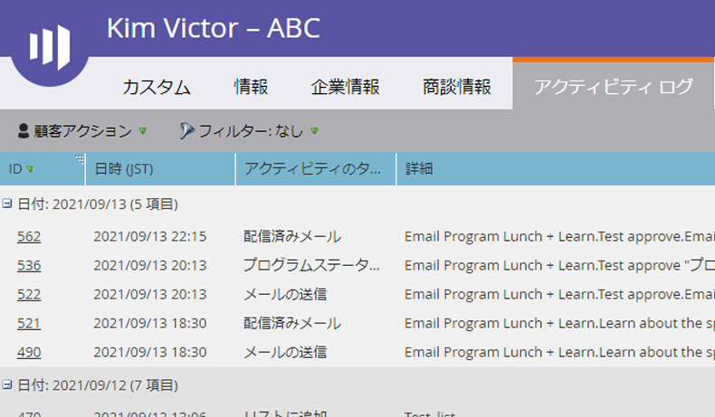
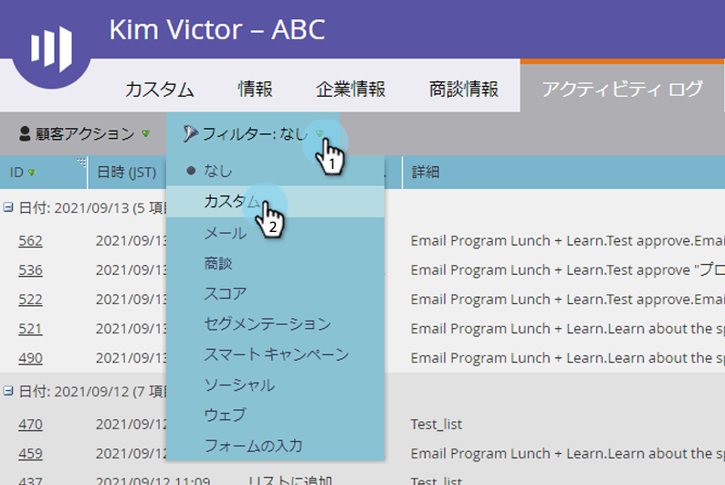
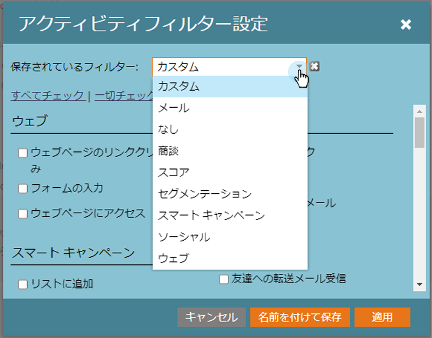

# 人物のアクティビティログでのアクティビティタイプのフィルタリング {#filter-activity-types-in-the-activity-log-of-a-person}

アクティビティログで、自分にとって最も重要なアクティビティを検索します。

>[!NOTE]
>
>詳しくは、[アクティビティログ](/help/marketo/product-docs/core-marketo-concepts/smart-lists-and-static-lists/managing-people-in-smart-lists/locate-the-activity-log-for-a-person.md){target="_blank"}を参照してください。

1. 人物の詳細ページに移動します。 「**[!UICONTROL アクティビティログ]**」タブをクリックします。

   

1. 「**&#x200B;**&#x200B;フィルター」ドロップダウンを選択します。

   

## カスタムフィルターを作成する {#creating-custom-filters}

1. 「**&#x200B;**&#x200B;フィルター」ドロップダウンをクリックします。 「**[!UICONTROL カスタム]**」を選択します。

   

1. フィルターに使用するアクティビティを選択します。 「**[!UICONTROL 別名で保存]**」をクリックします。

   

1. **[!UICONTROL カスタムフィルター名]**&#x200B;を入力します。 「**[!UICONTROL 保存]**」をクリックします。

   

   フィルターの条件を満たすユーザーアクティビティのみが表示されます。

   

## 保存済みフィルターを参照する {#reference-saved-filters}

保存済みフィルターには、「[!UICONTROL フィルター]」ドロップダウンリストからアクセスできます。

1. 「**&#x200B;**&#x200B;フィルター」ドロップダウンをクリックします。 「**[!UICONTROL カスタム]**」を選択します。

   

1. 「**[!UICONTROL 保存済みフィルター]**」をクリックします。 保存済みフィルターを以下に示します。

   
