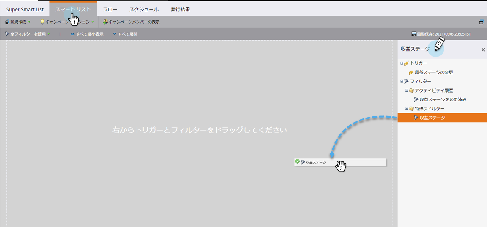
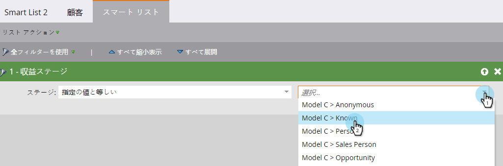
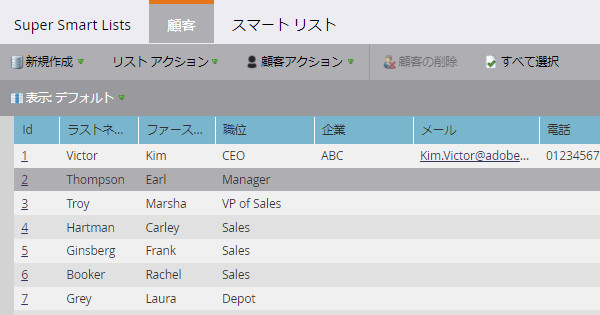
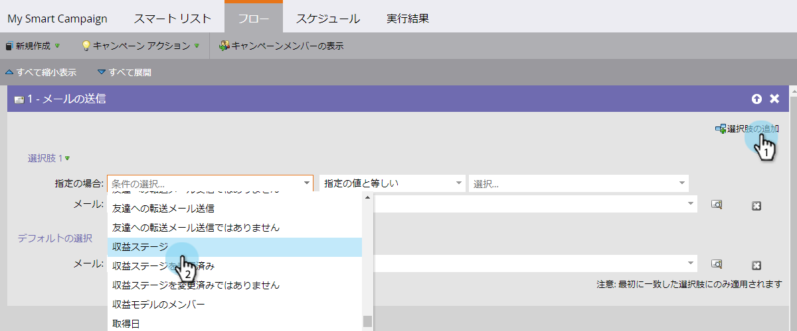

# 売上高段階ですべての人を検索{#find-all-people-in-a-revenue-stage}

>[!PREREQUISITES]
>
>* [スマートリストの作成](../../../../product-docs/core-marketo-concepts/smart-lists-and-static-lists/creating-a-smart-list/create-a-smart-list.md)

>

## 特定の売上高ステージのすべてのメンバーの検索{#find-all-members-of-a-specific-revenue-stage}

1. スマートリストで、「**スマートリスト**」タブをクリックし、**売上高ステージ**&#x200B;フィルターを探して、キャンバスにドラッグします。

   

1. **売上高ステージ**&#x200B;を選択します。

   

1. 「**人**」タブに移動して、結果を表示します。

   

## 売上高ステージのメンバーに対するフローステップの実行{#run-a-flow-step-on-the-members-of-a-revenue-stage}

どの人々がどの売上の段階にあるかが分かったので、その人々に直接マーケティングできます。 **売上高ステージ**&#x200B;をスマートリストフィルターとして選択する以外に、フロー内で「if」フィルターとして選択することもできます。

1. 目的のフロー手順で、「**選択追加肢**」をクリックし、ドロップダウンから「**売上高ステージ**」を選択します。

   

   ここから、フローステップのどの側面に影響を受けるメンバを選択できます。 楽しい！

