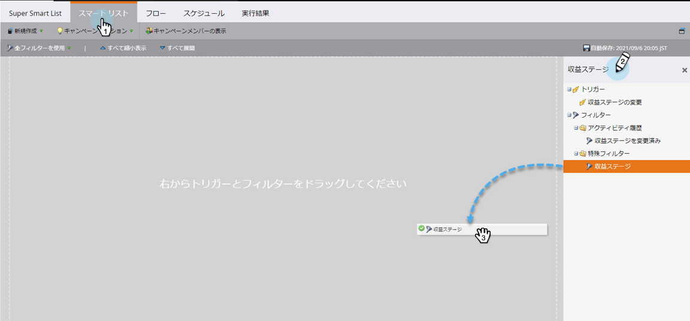
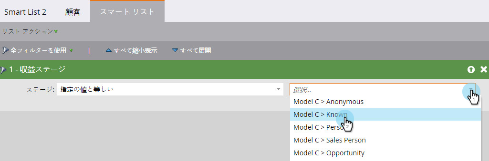
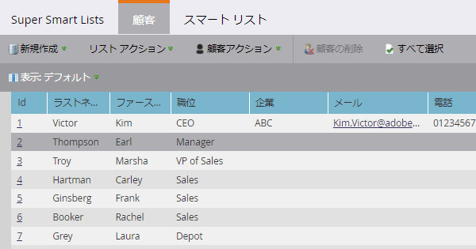
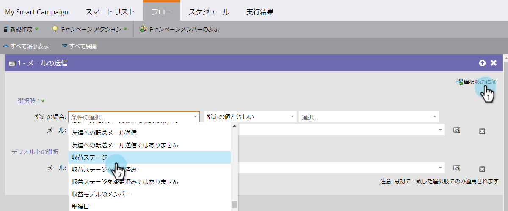

# 収益ステージにいるすべての人物を検索 {#find-all-people-in-a-revenue-stage}

>[!PREREQUISITES]
>
>[スマートリストの作成](/help/marketo/product-docs/core-marketo-concepts/smart-lists-and-static-lists/creating-a-smart-list/create-a-smart-list.md){target="_blank"}

## 特定の収益ステージのメンバーをすべて検索する {#find-all-members-of-a-specific-revenue-stage}

1. スマートリストで、**[!UICONTROL スマートリスト]** タブをクリックし、**[!UICONTROL 収益ステージ]** フィルターを見つけて、キャンバスにドラッグします。

   

1. **[!UICONTROL 収益ステージ]**&#x200B;を選択します。

   

1. 「**[!UICONTROL 人物]**」タブに移動して、結果を確認します。

   

## 収益ステージのメンバーに対してフローステップを実行する {#run-a-flow-step-on-the-members-of-a-revenue-stage}

どの人物がどの収益段階にあるかがわかったので、直接その人たちにマーケティングできます。 スマートリストフィルターとして&#x200B;**[!UICONTROL 収益ステージ]**&#x200B;を選択するだけでなく、フローの「if」フィルターとして選択することもできます。

1. 目的のフローステップで、「**[!UICONTROL 選択肢を追加]**」を選択し、「**[!UICONTROL 収益ステージ]**」をクリックします。

   

   そこから、フローステップのどの側面の影響を受けるメンバーを選択できます。
