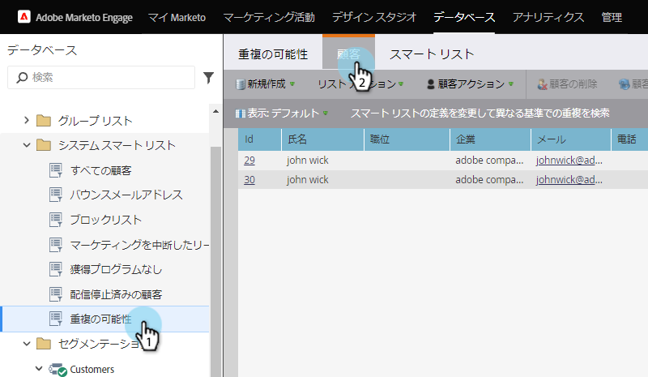
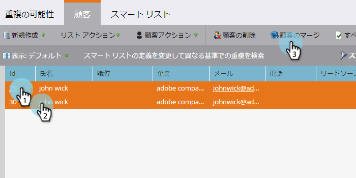
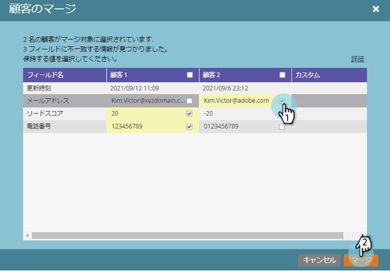

# 重複ユーザーの検索と結合 {#find-and-merge-duplicate-people}

新しい人がシステムに入ると、重複が自動的に取り消されます。 ただし、CRMが最初に重複をMarketorに送信した可能性があります。 これらを統合する方法を次に示します。

>[!NOTE]
>
>**FYI**
>
>Marketoは現在、すべての購読で言語を標準化しているので、購読およびdocs.marketo.comの人物/人物にリード/リードを表示できます。 これらの用語は同じことを意味し、記事の説明には影響しません。 他にも変化がある。 [詳細情報](http://docs.marketo.com/display/DOCS/Updates+to+Marketo+Terminology)。

>[!NOTE]
>
>Marketorは、SalesforceまたはMicrosoft Dynamicsの同期に対して、またはユーザーを手動で入力した場合に、自動的に重複除外を実行しません。

>[!PREREQUISITES]
>
>重複の検索と結合には、 [組み込み/システムスマートリストの使用が含まれます](../../../../product-docs/core-marketo-concepts/smart-lists-and-static-lists/using-smart-lists/use-built-in-system-smart-lists.md)。

## 重複の検索 {#find-duplicates}

1. 「 **Database** 」領域に移動します。

   

   >[!CAUTION]
   >
   >Salesforce個人アカウントを使用している場合、Marketorでのユーザーの結合が機能しない場合があります。 可能な場合は、Salesforceのレコードを結合してください。

1. 「 **可能な** 重複 **(** 可能) **」システムスマートリストを選択し、「** 人物」タブをクリックします。

   

   >[!NOTE]
   >
   >カスタムロジックを使用して、重複の人を [検索することもできます](find-duplicate-people-with-custom-logic.md)。

## ユーザーを手動で結合 {#merge-people-manually}

>[!CAUTION]
>
>ユーザーをマージする際、敗者にマーケティングのカスタムオブジェクトがある場合、そのユーザーは勝者に再関連付けされ **ません** 。 結合を実行する前に、カスタムオブジェクトの親を再度設定してください。

Ctrl/Commandキーを押しながらをクリックし、「重複を結合」をクリックして、ユーザーを選択します。

>[!TIP]
>
>同じ人物に対して複数の重複を設定できます。すべてを一度に選択します。

1. 一致しないレコード間の値が表示さ *れます* 。 各フィールドに保持する値を選択します。 終了したら **結合** をクリックします。 どちらの値も必要ない場合は、[ **カスタム** ]チェックボックスをオンにして、選択した値を入力できます。

   

   >[!NOTE]
   >
   >ユーザーを手動で結合する場合、最初に選択したユーザーが「勝者」になります。 したがって、198と199のレコードIDを結合している場合、最初に199をクリックすると、「人」タブで、結合した人のレコードIDが199になります。 これは、3つ以上のレコードが結合される場合にも当てはまります。

   >[!TIP]
   >
   >結合は、削除するよりも良いです。 すべての履歴（ページ訪問数、リンククリック数、電子メールの開封、フォームの入力など）を節約します。

## Salesforceでの効果 {#effect-in-salesforce}

Salesforce統合を使用している場合、Salesforceでのリードの結合の効果についていくつかのメモがあります。

    *リードのみまたは連絡先のみをマージする場合、通常のSalesforceルールごとにマージされます。
    *リードとコンタクトをマージする場合、通常のSalesforceルールに従ってマージする前に、すべてのリードがコンタクトに変換されます。

リードまたは連絡先を結合する際のSalesforceの動作の詳細については、以下のSalesforceドキュメントを確認してください。

    * [重複のリードを結合](https://help.salesforce.com/HTViewHelpDoc?id=leads_merge.htm&amp;language=en_US)
    * [重複の連絡先を結合](https://help.salesforce.com/HTViewHelpDoc?id=contacts_merge.htm&amp;language=en_US)

## 一括結合 {#bulk-merging}

手動で結合する重複が多すぎる場合は、カスタマーサクセスマネージャーにお問い合わせください。

超！ CRMに接続している場合、レコードは次の規則に従ってCRMに結合されます。