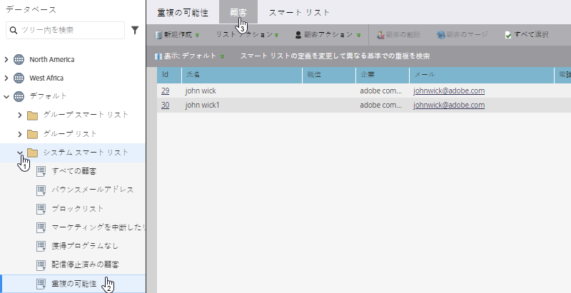
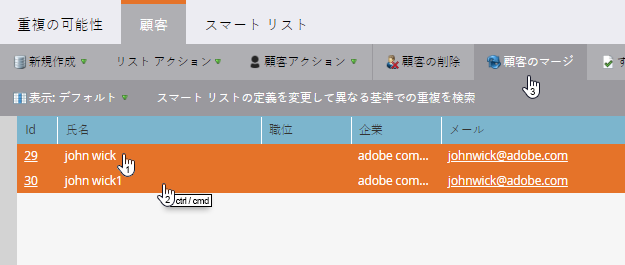
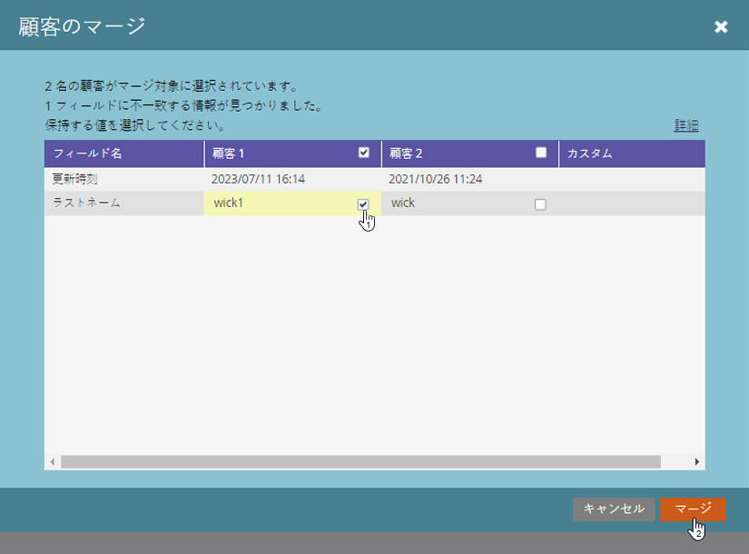

# 重複した人物の検索と結合 {#find-and-merge-duplicate-people}

Marketo は、新しい人物がシステムに入ると、自動的に重複排除します。 ただし、CRM が最初に重複を Marketo に送信している可能性があります。

>[!CAUTION]
>
>人物の結合は、恒常的で、「元に戻す」オプションはありません。

>[!PREREQUISITES]
>
>重複を検索して結合するには、[組み込み/システム スマートリスト ](/help/marketo/product-docs/core-marketo-concepts/smart-lists-and-static-lists/using-smart-lists/use-built-in-system-smart-lists.md){target="_blank"}を使用します。

>[!NOTE]
>
>Marketo は、[!DNL Salesforce] または [!DNL Microsoft Dynamics] の同期や、人物を手動で入力した場合には、自動的に重複排除を行いません。

## 重複を検索する {#find-duplicates}

1. 「**[!UICONTROL データベース]**」領域に移動します。

   

   >[!CAUTION]
   >
   >[!DNL Salesforce] の個人取引先を使用している場合は、Marketo の人物の結合が機能しない場合があります。 可能であれば、[!DNL Salesforce]のレコードを結合します。

1. システムスマートリストから&#x200B;**[!UICONTROL 重複の可能性]**&#x200B;を選択し、「**[!UICONTROL 人物]**」タブをクリックします。

   

   >[!NOTE]
   >
   >また、[カスタムロジックで重複する人物を検索](/help/marketo/product-docs/core-marketo-concepts/smart-lists-and-static-lists/managing-people-in-smart-lists/find-duplicate-people-with-custom-logic.md){target="_blank"}することもできます。

## 人物を手動で結合する {#merge-people-manually}

>[!CAUTION]
>
>人物を結合する際に、敗者に Marketo のカスタムオブジェクトがあっても、勝者への再関連付けは&#x200B;_行われません_。 結合を実行する前に、カスタムオブジェクトを再ペアレント化します。

1. Ctrl／Cmd キーを押しながら重複を選択し、「**[!UICONTROL 人物を結合]**」をクリックします。

   

   >[!TIP]
   >
   >同じ人物に対して 2 つ以上の重複が存在する場合があります。それらすべてを一度に選択します。

1. 一致しないレコード間の値が表示されます。 _各フィールドに保持する値を選択_。 終了したら「**[!UICONTROL 結合]**」をクリックします。 どちらの値も不要な場合は、「**[!UICONTROL カスタム]**」にチェックを入れて任意の値を入力します。

   

   >[!NOTE]
   >
   >* Salesforceとは異なり、Marketoで人物を結合する場合、そのスコアは&#x200B;_not_&#x200B;合計されます。 保持する値を選択します。
   >
   >* 人物を手動で結合する場合、最初に選択した人物が「勝者」になります。 つまり、「人物」タブでレコード ID 198 と 199 を結合するときに、最初に 199 をクリックした場合、199 が結合された人のレコード ID になります。 これは、2 つ以上のレコードが結合される場合にも当てはまります。

   >[!TIP]
   >
   >結合は削除よりも適しています。 すべての履歴（ページ訪問数、リンククリック数、メール開封数、フォームの入力数など）は維持されます。

## Salesforce での効果 {#effect-in-salesforce}

Salesforce と統合している場合、Salesforce のリードの結合の効果に関していくつかの注意事項があります。

* リードのみまたは取引先責任者のみを結合する場合、通常の [!DNL Salesforce] ルールに従って結合されます。
* リードと取引先責任者を結合する場合、通常の [!DNL Salesforce] ルールに従って結合する前に、すべてのリードが取引先責任者にコンバージョンされます。

リードまたは取引先責任者を結合する際のSalesforceの動作について詳しくは、次の[!DNL Salesforce]件のドキュメントを確認してください。

* [重複するリードの結合](https://help.salesforce.com/HTViewHelpDoc?id=leads_merge.htm&language=en_US){target="_blank"}
* [重複した連絡先の結合](https://help.salesforce.com/HTViewHelpDoc?id=contacts_merge.htm&language=en_US){target="_blank"}

## 一括マージ {#bulk-merging}

重複が多すぎて手動で結合できない場合は、アドビアカウントチーム（担当のアカウントマネージャー）に連絡して、オプションについてご相談ください。
