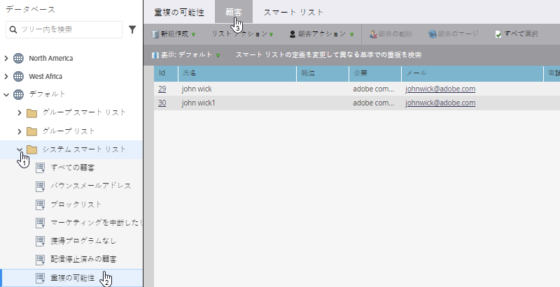
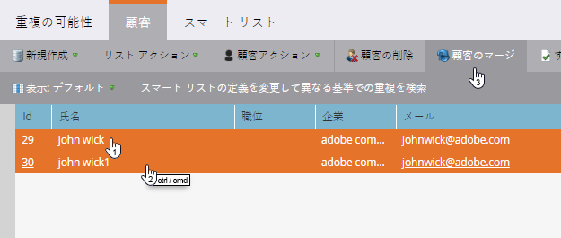
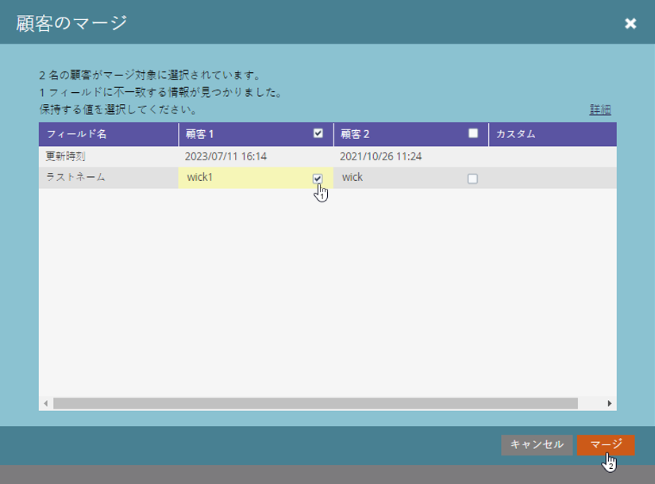

# 重複した人物の検索と結合 {#find-and-merge-duplicate-people}

Marketo は、新しい人物がシステムに入ると、自動的に重複排除します。ただし、CRM が最初に重複を Marketo に送信している可能性があります。結合する方法は以下のとおりです。

>[!CAUTION]
>
>担当者のマージは永続的です。「元に戻す」オプションはありません。

>[!PREREQUISITES]
>
>重複の検索とマージには、[組み込み／システムスマートリスト](/help/marketo/product-docs/core-marketo-concepts/smart-lists-and-static-lists/using-smart-lists/use-built-in-system-smart-lists.md){target="_blank"}を使用することになります。

>[!NOTE]
>
>Marketo は、Salesforce や Microsoft Dynamics の同期や、人物を手動で入力した場合には、自動的に重複排除を行いません。

## 重複を検索する {#find-duplicates}

1. 「**データベース**」領域に移動します。

   

   >[!CAUTION]
   >
   >Salesforce の人物アカウントを使用している場合は、Marketo の人物の結合が機能しない場合があります。可能な場合は、Salesforce でレコードを結合してください。

1. 「**重複の可能性**」システムスマートリストを選択し、「**人物**」タブをクリックします。

   

   >[!NOTE]
   >
   >また、[カスタムロジックで重複する人物を検索](/help/marketo/product-docs/core-marketo-concepts/smart-lists-and-static-lists/managing-people-in-smart-lists/find-duplicate-people-with-custom-logic.md){target="_blank"}することもできます。

## 人物を手動で結合する {#merge-people-manually}

>[!CAUTION]
>
>人物を結合する際に、敗者に Marketo のカスタムオブジェクトがあっても、勝者への再関連付けは&#x200B;**行われません**。結合を実行する前に、カスタムオブジェクトの親の関連付けを再度行ってください。

1. Ctrl／Cmd キーを押しながら重複を選択し、「**人物を結合**」をクリックします。

   

   >[!TIP]
   >
   >同じ人物に対して 2 つ以上の重複が存在する場合があります。それらすべてを一度に選択します。

1. レコード間で&#x200B;_一致しない_&#x200B;値が表示されます。各フィールドに保持する値を選択します。終了したら「**結合**」をクリックします。どちらの値も不要な場合は、「**カスタム**」にチェックを入れて任意の値を入力します。

   

   >[!NOTE]
   >
   >人物を手動で結合する場合、最初に選択した人物が「勝者」になります。つまり、「人物」タブでレコード ID 198 と 199 を結合するときに、最初に 199 をクリックした場合、199 が結合された人のレコード ID になります。これは、2 つ以上のレコードが結合される場合にも当てはまります。

   >[!TIP]
   >
   >結合は削除よりも適しています。すべての履歴（ページ訪問数、リンククリック数、メール開封数、フォームの入力数など）は維持されます。

## Salesforce での効果 {#effect-in-salesforce}

Salesforce 統合がある場合は、Salesforce 内のリードを結合した結果に関するメモがいくつかあります。

* リードのみまたは連絡先のみを結合する場合、通常の Salesforce ルールに従って結合されます。
* リードと連絡先を結合する場合、通常の Salesforce ルールに従って結合する前に、すべてのリードが連絡先にコンバージョンされます。

リードまたは連絡先を結合する際の Salesforce の動作の詳細は、次の Salesforce ドキュメントを確認してください。

* [重複したリードの結合](https://help.salesforce.com/HTViewHelpDoc?id=leads_merge.htm&amp;language=en_US){target="_blank"}
* [重複した連絡先の結合](https://help.salesforce.com/HTViewHelpDoc?id=contacts_merge.htm&amp;language=en_US){target="_blank"}

## 一括結合 {#bulk-merging}

重複が多すぎて手動で結合できない場合は、アドビアカウントチーム（担当のアカウントマネージャー）に連絡して、オプションについてご相談ください。
