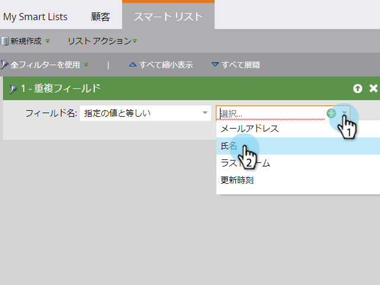

# カスタムロジックを使用した重複人物の検索{#find-duplicate-people-with-custom-logic}

Marketoには、電子メールアドレスを照合して重複の人々を見つけるシステムスマートリストがあります。 別のフィールドを使用して重複を検索する場合は、次のようにします。

>[!PREREQUISITES]
>
>[スマートリストの作成](/help/marketo/product-docs/core-marketo-concepts/smart-lists-and-static-lists/creating-a-smart-list/create-a-smart-list.md)

1. **マーケティングアクティビティ**&#x200B;エリアに移動します。

1. スマートリストを選択し、「**スマートリスト**」タブをクリックします。

   

1. **重複フィールド**&#x200B;フィルターを探してキャンバスにドラッグします。

   

1. 次の4つのオプションから1つ選択します。

   * メールアドレス
   * 氏名
   * 姓
   * 更新時刻

   >[!NOTE]
   >
   >「電子メールアドレス」を除くすべてのフィールドでは、大文字と小文字が区別されます。 したがって、フルネームフィールドに「john doe」を入力すると、John Doeの結果は&#x200B;__&#x200B;返されません。

   

   完了! スマートリストを実行して、前に選択したフィールドに同じ値を持つ人を検索します。
