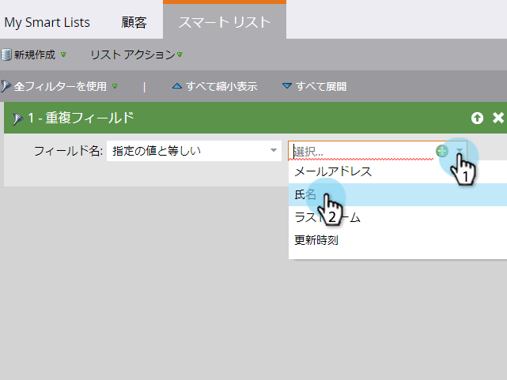

# カスタムロジックでの重複リードの検索 {#find-duplicate-people-with-custom-logic}

Marketo Engage には、メールアドレスを照合して重複するリードを見つけるシステムスマートリストがあります。 別のフィールドを使用して、との重複を見つける場合は、次の手順に従います。

>[!PREREQUISITES]
>
>[スマートリストの作成](/help/marketo/product-docs/core-marketo-concepts/smart-lists-and-static-lists/creating-a-smart-list/create-a-smart-list.md){target="_blank"}

1. 「**[!UICONTROL マーケティング活動]**」領域に移動します。

1. スマートリストを選択し、「**[!UICONTROL スマートリスト]**」タブをクリックします。

   

1. **[!UICONTROL 重複フィールド]**&#x200B;フィルターを探してキャンバスにドラッグします。

   

1. 次の 4 つのオプションの中から 1 つを選択します。

   * [!UICONTROL メールアドレス]
   * [!UICONTROL 姓名]
   * [!UICONTROL 名前（姓）]
   * [!UICONTROL 更新日時]

   >[!NOTE]
   >
   >「メールアドレス」を除くすべてのフィールドでは、大文字と小文字が区別されます。 したがって、「姓名」フィールドに「john doe」と入力すると、「John Doe」は結果に&#x200B;_返されません_。

   

   スマートリストを実行すると、あらかじめ選択したフィールドに同じ値を持つリードを検索できます。
