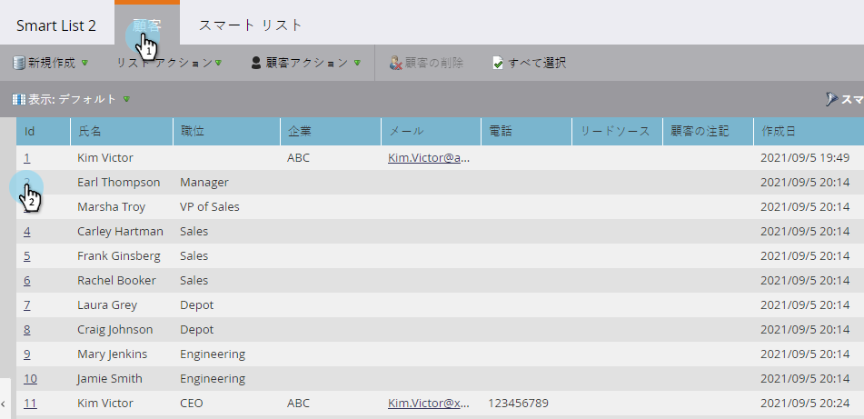
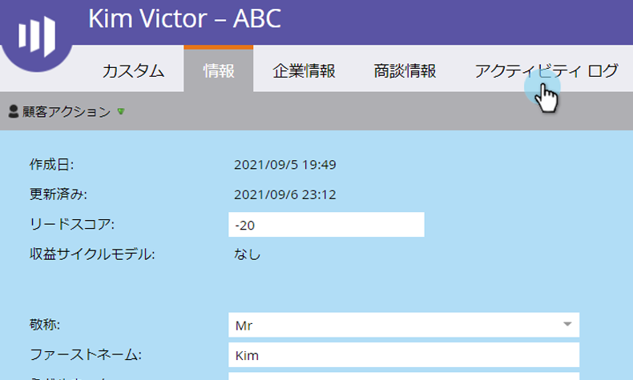
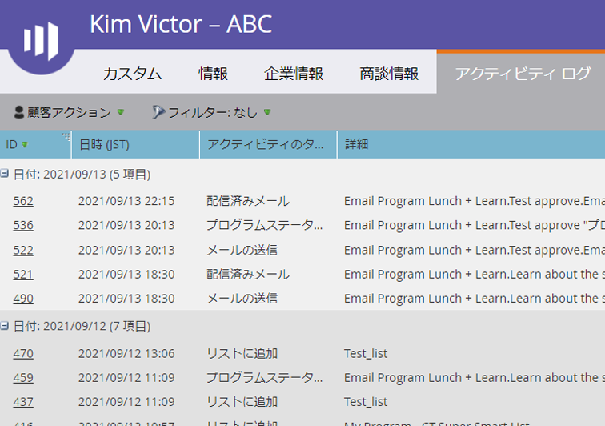
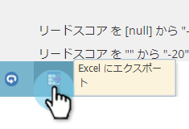

# リードのアクティビティログの検索 {#locate-the-activity-log-for-a-person}

アクティビティログは、最終的な情報の拠り所です。ログには、Marketo でリードがたどる道筋が完全に記録されています。

1. 「**データベース**」に移動します。

   

1. 「**すべてのリード**」を選択します。

   

1. 「**リード**」タブをクリックします。リードの **ID** 番号を選択します。

   

1. 「**アクティビティログ**」をクリックします。

   

   これで、ある人の時間の経過に伴って発生するすべての情報のコレクションが作成されました。

   

## アクティビティログの書き出し {#export-activity-log}

ユーザーのアクティビティログをExcelに書き出す必要がある場合

1. 上記の手順に従った後、ページの下部までスクロールし、「書き出し」アイコンを選択します。

   

1. Excelファイルがブラウザーにダウンロードされます。

   

   >[!MORELIKETHIS]
   >
   >特定のリードのアクティビティを確認するには、[アクティビティログのフィルタリング](/help/marketo/product-docs/core-marketo-concepts/smart-lists-and-static-lists/managing-people-in-smart-lists/filter-activity-types-in-the-activity-log-of-a-person.md)を参照してください。
