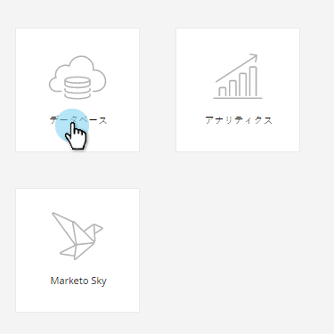

# リードのアクティビティログの検索 {#locate-the-activity-log-for-a-person}

アクティビティログは、最終的な情報の拠り所です。これは、Marketo Engageの人の旅の完全な物語です。

1. 「**[!UICONTROL データベース]**」に移動します。

   

1. 「**[!UICONTROL すべてのリード]**」を選択します。

   

1. 「**[!UICONTROL リード]**」タブをクリックします。リードの **[!UICONTROL ID]** 番号を選択します。

   

1. 「**[!UICONTROL アクティビティログ]**」をクリックします。

   

   これまで人物に起こった情報をすべて集めたものです。

   

## アクティビティログをエクスポートする {#export-activity-log}

人物のアクティビティログを Excel にエクスポートする必要がありますか？

1. 上記の手順に従った後、ページの下部までスクロールし、「エクスポート」アイコンを選択します。

   

1. Excel ファイルがブラウザーにダウンロードされます。

   

   >[!MORELIKETHIS]
   >
   >特定のリードのアクティビティを確認するには、[アクティビティログのフィルタリング](/help/marketo/product-docs/core-marketo-concepts/smart-lists-and-static-lists/managing-people-in-smart-lists/filter-activity-types-in-the-activity-log-of-a-person.md){target="_blank"}を参照してください。
