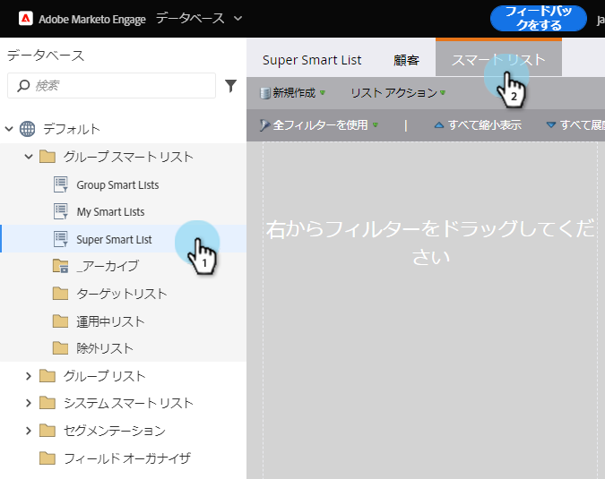
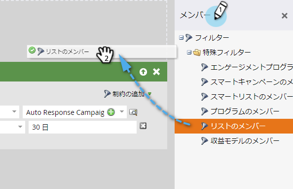
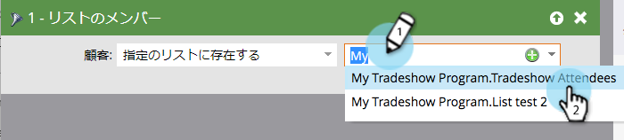

# スマートリストでのリストのメンバーの使用 {#use-members-of-list-in-a-smart-list}

>[!TIP]
>
>「 [インポート](../../../../getting-started/quick-wins/import-a-list-of-people.md) 」または「リストへのフロー」ステップを使用して [、リストに人を追加でき](../../../../product-docs/core-marketo-concepts/smart-campaigns/flow-actions/add-to-list.md)ます。

このフィルタを使用すると、スマートリストルールでそのフィルタを参照して、別のリストからメンバを引き出すことができます。 これが方法です。

1. スマートリストを選択し、「 **スマートリスト** 」タブをクリックします。

   

1. 右側のフィルターパネルで、「リストの **メンバー** 」フィルターを検索し、カンバスにドラッグします。

   

1. ドロップダウンをクリックするか、または入力して、スマートリストに含めるリストを検索します。

   

   **完了！** この例では、スマートリストは、そのリストのメンバーのみをターゲットし、含める他のルールに基づいて評価するようになります。

