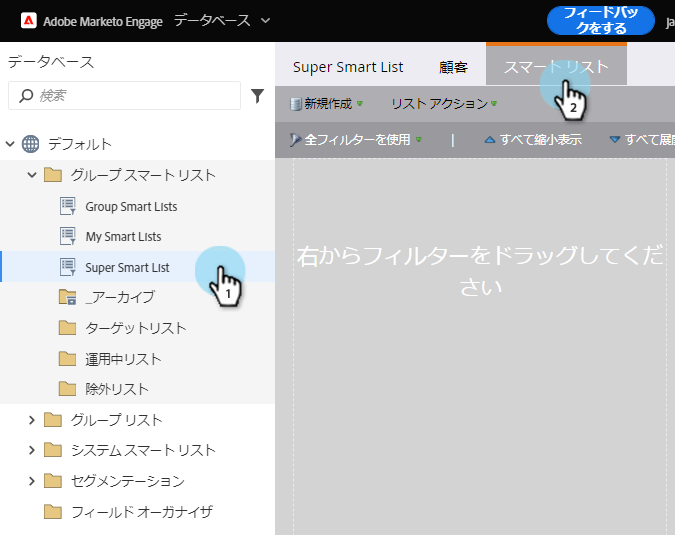
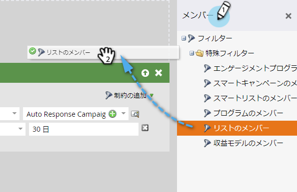
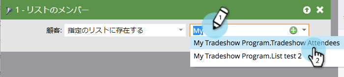

# スマートリストでのリストメンバーの使用 {#use-members-of-list-in-a-smart-list}

>[!TIP]
>
>リストに人物を追加するには、「[インポート](/help/marketo/getting-started/quick-wins/import-a-list-of-people.md)」または、「[リストに追加](/help/marketo/product-docs/core-marketo-concepts/smart-campaigns/flow-actions/add-to-list.md){target="_blank"}」フローステップを使用します。

このフィルタを使用すると、スマート・リスト・ルールで参照することにより、別のリストからメンバーを取り込むことができます。 手順は次のとおりです。

1. スマート・リストを選択し、「**[!UICONTROL スマート・リスト]**」タブをクリックします。

   

1. 右側のフィルターパネルで、「**[!UICONTROL リストのメンバー]**」フィルターを検索してキャンバスにドラッグします。

   

1. ドロップダウンをクリックするか、と入力して、スマートリスト内に含めるリストを検索します。

   

   完了です。この例では、スマートリストは、そのリストのメンバーのみをターゲットにし、含む他のルールに基づいて評価するようになりました。
