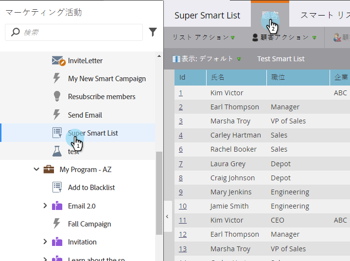
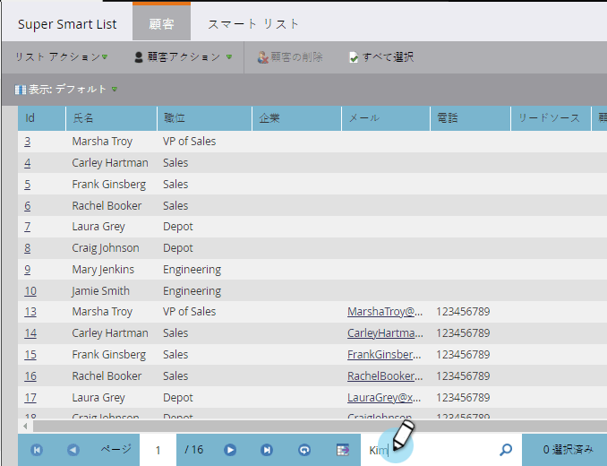
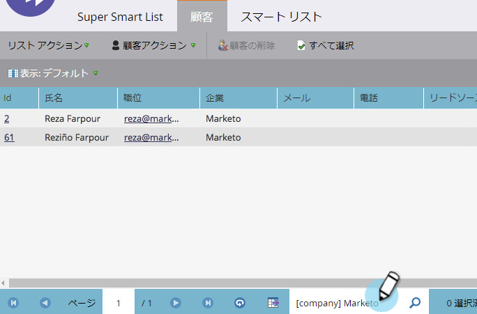

# リストまたはスマートリストでクイック検索を使用{#use-quick-find-in-a-list-or-smart-list}

クイック検索を使用して、リストまたはスマートリストの結果から人を検索します。

1. **マーケティングアクティビティ**&#x200B;に移動します。

   

1. 検索するスマートリストを選択し、「**ユーザー**」タブをクリックします。

   

## 個人情報を使用した人の検索{#find-people-using-personal-info}

1. 画面の下部にある「**クイック検索**」ボックスに、キーワード（**個人名**、**電子メールアドレス**、または&#x200B;**ジョブタイトル**）を入力します。

   

1. Enterキーを押すか、検索アイコンをクリックすると完了です。

## 会社名を使用したユーザーの検索{#find-people-using-a-company-name}

1. 会社を検索するには、「**クイック検索**」ボックスに&#x200B;[**会社**]&#x200B;と入力し、検索する会社名の任意の部分を入力します。

   

1. Enterキーを押すか、検索アイコンをクリックすると完了です。

おめでとうございます。
