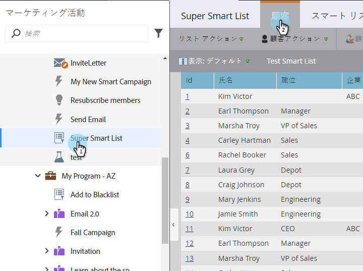
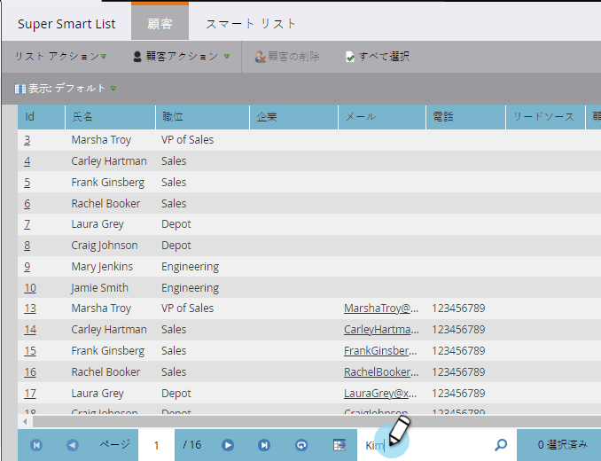
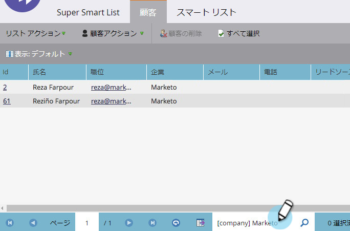

# リストまたはスマートリストでのクイック検索の使用 {#use-quick-find-in-a-list-or-smart-list}

リストまたはスマートリストの結果から、クイック検索を使用してユーザーを検索します。

1. **[!UICONTROL マーケティングアクティビティ]**&#x200B;に移動します。

   

1. 検索するスマートリストを選択し、「**[!UICONTROL ユーザー]**」タブをクリックします。

   

## 個人情報を使用して人物を検索する {#find-people-using-personal-info}

1. 画面下部の「**[!UICONTROL クイック検索]**」ボックスに、キーワード（**個人名**、**メールアドレス**&#x200B;または&#x200B;**役職**）を入力します。

   

1. Enter キーを押すか、検索アイコンをクリックすると、完了です。

## 会社名を使用して人物を検索する {#find-people-using-a-company-name}

1. 会社を検索するには、「クイック検索」ボックスに「`[company]`」と入力し、続いて探している会社名の任意の部分を入力します。

   

1. Enter キーを押すか、検索アイコンをクリックすると、完了です。
