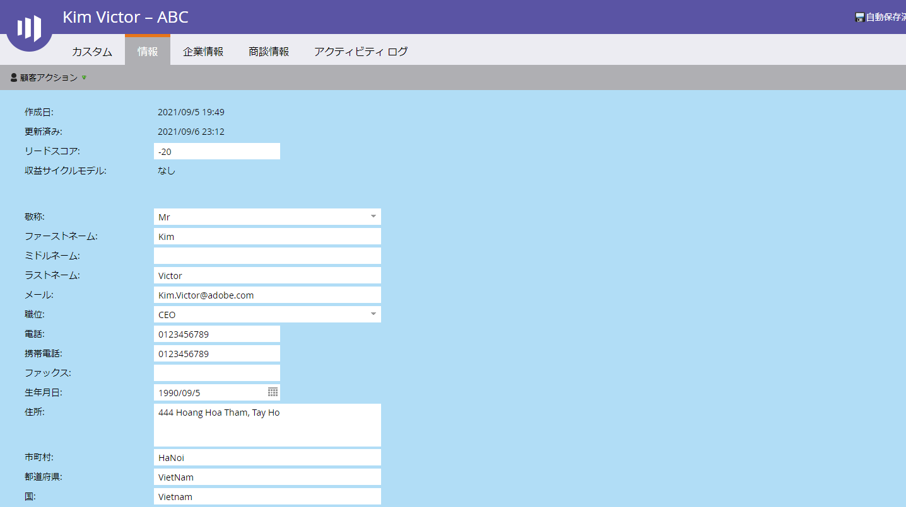
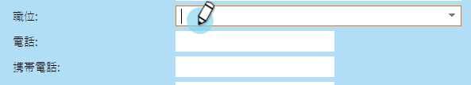

# 個人の詳細ページの使用{#using-the-person-detail-page}

個人の詳細ページには、Marketing担当者が個人について知っているすべての情報が含まれます。 このページからデータを直接編集できます。

## 個人の詳細ページへのアクセス{#getting-to-person-detail-page}

特定の人を開く方法はたくさんあります。 次に例を示します。

* **データベース**&#x200B;から、クイック検索で検索できます
* 任意のスマート&#x200B;**リスト**&#x200B;またはリスト
* **プログラム** のメンバー
* **表示キャンペーン** メンバーシンアスマートキャンペーン
* **レポート**の一部

     

1. 任意の人を重複クリックするか、左側のIDをシングルクリックします。

   

1. これで、個人の詳細画面が開きます。

   

## ページ構成 — Salesforce {#page-organization-salesforce}

個人情報は、次のタブに分類されます。

| タブ | 説明 |
|---|---|
| 情報 | 連絡先情報およびユーザー設定のフィールド。 |
| 会社情報 | 個人の会社情報と住所。 |
| オポチュニティ情報 | Salesforceから同期されたオポチュニティ情報。 |
| SFDCリードフィールド | 組み込みのSalesforceフィールド。 |
| SFDCカスタムフィールド | カスタムのSalesforceフィールド。 |
| アクティビティログ | その人に関連するすべてのアクティビティ。 |

## ページ構成 — Microsoft Dynamics {#page-organization-microsoft-dynamics}

| タブ | 説明 |
|---|---|
| 情報 | 連絡先情報およびユーザー設定のフィールド。 |
| 会社情報 | 個人の会社情報と住所。 |
| オポチュニティ情報 | Microsoftから同期されたオポチュニティ情報。 |
| Microsoftカスタムフィールド | ユーザー設定のMicrosoftフィールド |
| Microsoftリードフィールド | 組み込みのMicrosoftフィールド |
| アクティビティログ | その人に関連するすべてのアクティビティ。 |

## フィールドの編集{#editing-a-field}

編集可能なフィールドが多数あります。 ユーザーの情報を更新するには、新しい値を入力し、フィールドの外側をクリックして保存します。

## CRM同期前のマーケティング担当者のデフォルトフィールド{#marketo-default-fields-prior-to-crm-sync}

|  |  |  |  |  |
|---|---|---|---|---|
| 住所 | 年間売上高 | 匿名IP | 請求先住所 | 請求先の市区町村 |
| 請求国 | 請求先郵便番号 | 請求先の州 | 市区町村 | 会社名 |
| 国 | 作成日 | 生年月日 | 分野 | 呼び出さない |
| 原因を呼び出さない | 理由を呼び出さない | 電子メールアドレス | 電子メールが無効です | 電子メールの原因 |
| 外部会社ID | 外部販売担当者ID | Fax番号 | 名 | フルネーム |
| 業界 | 推定都市 | 推定会社 | 推定国 | 推定都市圏 |
| 推定電話番号市外局番 | 推定郵便番号 | 推定状態領域 | 匿名 | お客様 |
| パートナー | 肩書 | 姓 | 評価 | スコア |
| 個人のソース | ステータス | メイン電話 | Marketor SocialのFacebookの表示名 | Marketor SocialのFacebook Id |
| Marketor SocialのFacebook写真のURL | Marketto SocialのFacebookプロファイルURL | Marketor SocialのFacebookリーチ | Marketor SocialのFacebook参照登録 | Marketor SocialのFacebookが参照した訪問 |
| Marketor Socialの性別 | Marketor Socialの最終参照登録 | Marketor Socialの最後の参照訪問 | Marketor SocialのLinkedIn表示名 | Marketor SocialのLinkedIn ID |
| Marketor SocialのLinkedIn写真のURL | Marketor Social LinkedInプロファイルのURL | Marketor SocialのLinkedInリーチ | Marketor Social LinkedIn参照登録 | Marketor Social LinkedInからの訪問 |
| Marketor SocialシンジケーションID | Marketor Socialの参照登録総数 | Marketor Socialの合計参照訪問回数 | Marketor SocialのTwitterの表示名 | Marketor SocialのTwitter Id |
| Marketto SocialのTwitter写真のURL | Marketto SocialのTwitterプロファイルのURL | Marketor SocialのTwitterリーチ | Marketor SocialのTwitterによる参照登録 | Marketor SocialのTwitterが参照した訪問 |
| ミドルネーム | 携帯電話番号 | 従業員数 | 電話番号 | 郵便番号 |
| 優先度 | 相対スコア | 役割 | 挨拶 | SICコード |
| サイト | 州 | 登録解除 | 登録解除の理由 | 更新日時 |
| 緊急度 | Webサイト |  |  |  |

>[!NOTE]
>
>一部のフィールドは編集できません&#x200B;__:
>
>* 会社情報
>* SFDCの連絡先のオポチュニティ
>* 「作成日」や「元のソースタイプ」など、マーケティング担当者に固有のフィールドがあります。
>* アクティビティログ

>
>
[システム管理フィールド](/help/marketo/product-docs/administration/field-management/understanding-system-managed-fields.md)の詳細を表示します。

>[!MORELIKETHIS]
>
>[個人の詳細ページ用のカスタムタブの作成](/help/marketo/product-docs/administration/settings/creating-a-custom-tab-for-the-person-detail-page.md)
