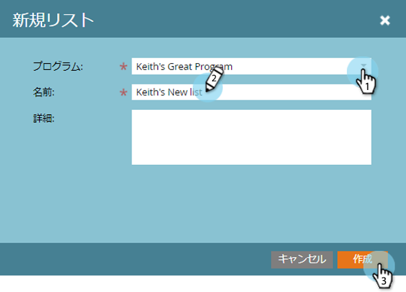

# 静的リストの作成 {#create-a-static-list}

静的リストは、既にデータベースに存在するユーザーのグループです。 作り方を次に示します。

>[!NOTE]
>
>**FYI**
>
>Marketoは現在、すべての購読で言語を標準化しているので、購読およびdocs.marketo.comの人物/人物にリード/リードを表示できます。 これらの用語は同じことを意味し、記事の説明には影響しません。 他にも変化がある。 [詳細情報](http://docs.marketo.com/display/DOCS/Updates+to+Marketo+Terminology)。

1. 「 **Database**」に移動します。

   

1. 「 **新規** 」ドロップダウンをクリックし、「 **新規リスト**」を選択します。

   

1. 保存先フォルダーを選択し、新しいリストーに名前を付けて、「 **作成**」をクリックします。

   

   これで、入力する空のリストが準備できました。 ユーザーを追加する方法につ [いて説明します](http://docs.marketo.com/display/DOCS/Understanding+Static+Lists#UnderstandingStaticLists-WaystoAdd/RemoveLeadsfromaList)。

   >[!NOTE]
   >
   >ユーザーをリストに何回でも追加できますが、表示されるのは1回のみです。 ユーザーは、削除するまでリストに残ります。

