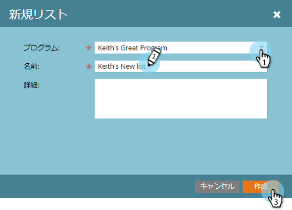

# 静的リストの作成 {#create-a-static-list}

静的リストとは、既にリードデータベースに登録されているリードのグループです。

1. **[!UICONTROL データベース]**&#x200B;に移動します。

   

1. 「**[!UICONTROL 新規作成]**」ドロップダウンをクリックして、「**[!UICONTROL 新規リスト]**」を選択します。

   

1. 作成先のフォルダーを選択し、新規リストに名前を付けてから「**[!UICONTROL 作成]**」をクリックします。

   

   空のリストが作成され、入力できるようになります。 リードを追加する方法は、[こちら](/help/marketo/product-docs/core-marketo-concepts/smart-lists-and-static-lists/static-lists/understanding-static-lists.md#ways-to-add-remove-people-from-a-list){target="_blank"}を参照してください。

   >[!NOTE]
   >
   >リストにユーザーを好きなだけ追加できますが、そのユーザーは1回だけ表示されます。 リードは、削除するまでリストに残り続けます。
