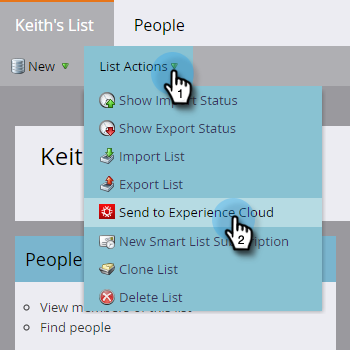

# 静的リストをAdobe Experience Cloudにエクスポート{#export-a-static-list-to-adobe-experience-cloud}

>[!NOTE]
>
>MarketorインスタンスのHIPAA対応の展開では、この機能を使用できません。

>[!PREREQUISITES]
>
>[Adobe Experience Cloudオーディエンス共有の設定](/help/marketo/product-docs/core-marketo-concepts/miscellaneous/set-up-adobe-experience-cloud-audience-sharing.md)

## サポートされる宛先アプリケーション{#supported-destination-applications}

* Adobe Advertising Cloud
* Adobe Analytics(Adobe Audience Managerのライセンスを所有している場合は&#x200B;**のみ**)
* Adobe Audience Manager
* Adobe Experience Manager
* Adobeリアルタイム顧客データプラットフォーム
* Adobe Target

## リストのエクスポート方法{#how-to-export-a-list}

1. Marketorで、エクスポートするリストを探して選択します。

   

1. **リストアクション**&#x200B;ドロップダウンをクリックし、**Experience Cloudに送信**&#x200B;を選択します。

   

1. 「**Audience Managerフォルダー**」ドロップダウンをクリックし、Experience Cloudー内の目的の保存先フォルダーを選択します。

   

1. 新しいオーディエンスを作成するか、既存のフォルダを上書きするかを選択します（この例では、新しいを作成します）。 新しいオーディエンス名を入力し、「**送信**」をクリックします。

   

1. 「**OK**」をクリックします。

   

   >[!NOTE]
   >
   >オーディエンスのメンバーシップがAdobeに完全に設定されるまで、最大6 ～ 8時間かかる場合があります。

## 注意事項{#things-to-note}

**Adobe Analyticsとの共有**

Adobe Audience ManagerとAdobe Analyticsの両方を所有するお客様の場合、この統合により、オーディエンスをMarketoからAdobe Analyticsのレポートスイートに共有できますが、これを有効にするにはAdobe Audience Managerで行う追加の設定手順がいくつかあります。 この設定方法の詳細については、Adobe Audience Managerのドキュメントを参照してください。[https://docs.adobe.com/content/help/en/analytics/integration/audience-analytics/mc-audiences-aam.html](https://docs.adobe.com/content/help/en/analytics/integration/audience-analytics/mc-audiences-aam.html).

**Adobe Audience Managerのお客様の特徴使用**

Marketoでリストのエクスポートを開始すると、Adobe Audience Managerのインスタンスに次の変更が反映されています。

* エクスポートされたリスト内のすべてのリードに対して、Marketorは、リードのハッシュされた電子メールをCross-Device Identifierとして使用して、特性を記述します。 特性の名前は、エクスポート時に指定した宛先オーディエンス名と一致します。
* Marketoが管理しているすべてのECIDが、エクスポートされたリストのリードと一致するように、MarketorはECID Device Identifierを使用して特性を記述します。 特性の名前は、エクスポート時に指定した宛先オーディエンス名と一致します。
* また、ECID特性をセグメント化基準として使用し、Audience Managerインスタンスにセグメントを作成します。 セグメントの名前は、エクスポート時に指定した宛先オーディエンス名と一致します。

## FAQ {#faq}

**マーケティングツールのリストサイズがAdobeのサイズと異なるのはなぜですか。**

内部では、オーディエンス統合は、Marketo Munchkinのcookieと対応するAdobeECID cookieを同期することで機能します。 Marketorは、ECIDを同期したリードのメンバーシップデータのみを共有できます。 最良の結果を得るために、マーケティングの目的でトラッキングするすべてのページのAdobeの訪問者.jsトラッキングコードと並行して、Marketoのmunchkin.jsトラッキングスクリプトを読み込むことをお勧めします。

**cookieの同期はどのように行われますか。**

Marketo購読でCookieの同期が有効になっている場合、Marketoのmunchkin.jsは、統合の設定時に指定したAdobeIMS組織のAdobeECIDを取得して保存し、これらのECIDを対応するMarketoのCookie識別子に一致させようとします。 これにより、Marketorの匿名ユーザープロファイルは、AdobeECIDを使用して利用できるようになります。

匿名ユーザープロファイルをリードプロファイルに関連付けるには、さらに手順が必要です。リードユーザーは、テキスト形式の電子メールを使用して識別されます。 この機能については、以下で説明します。[https://docs.marketo.com/display/public/DOCS/Tracking+Anonymous+Activity+and+People](https://docs.marketo.com/display/public/DOCS/Tracking+Anonymous+Activity+and+People).
