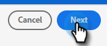
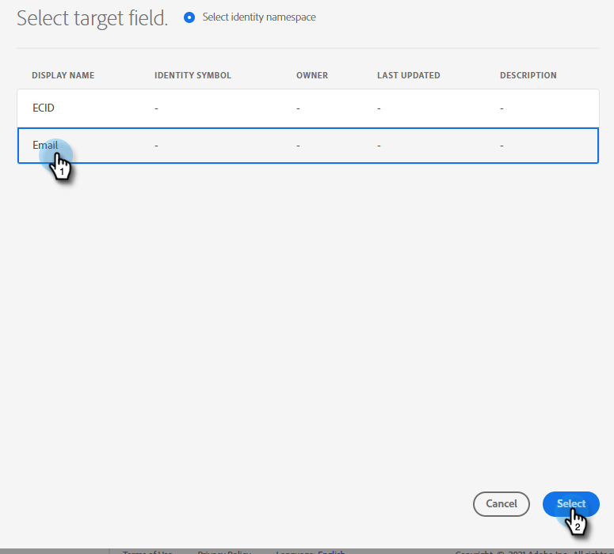

# Adobe Experience Cloud セグメントの Marketo 静的リストへのプッシュ {#push-an-adobe-experience-cloud-segment-to-a-marketo-static-list}

この機能を使用すると、Adobe Experience Platform にあるセグメントを静的リストの形式で Marketo にプッシュできます。

>[!PREREQUISITES]
>
>* Marketo で [API ユーザーを作成](/help/marketo/product-docs/administration/users-and-roles/create-an-api-only-user.md)します。
>* 次に、**管理**／ **Launchpoint** に移動します。作成した役割の名前を探し、「**詳細を表示**」をクリックします。この機能に必要なので、**クライアント ID** と&#x200B;**クライアントシークレット**&#x200B;の情報をコピーして保存します。

1. [Adobe Experience Platform](https://experience.adobe.com/) にログインします。

   

1. グリッドアイコンをクリックし、「**Experience Platform**」を選択します。

   

1. 左側のナビゲーションで、「**宛先**」をクリックします。

   

1. 「**カタログ**」をクリックします。

   

1. Marketo Engage タイルを見つけ、「**アクティブ化**」をクリックします。

   

1. アカウントタイプで、「**新規アカウント**」ラジオボタンをクリックします。Marketo の資格情報を入力し、「**宛先に接続**」をクリックします。

   

   >[!NOTE]
   >
   >**管理**／ **Munchkin** に移動すると、Munchkin ID を見つけることができます（ログイン後の Marketo URL の一部でもあります）。この記事の最上部にある前提条件に従って作成する必要があるクライアント ID／シークレット。

1. 「接続済み」が資格情報の下に表示されます。右上隅の「**次へ**」をクリックします。

   

1. **名前**&#x200B;と&#x200B;_オプションの_&#x200B;説明を入力します。「**宛先を作成**」をクリックします。

   >[!NOTE]
   >
   >マーケティングアクションからの選択もオプションです。Marketo では、現時点ではその情報を活用していませんが、近日中に活用するようになる可能性が高いです。

   

1. 「**次へ**」をクリックします。

   

1. 目的のセグメントを選択し、「**次へ**」をクリックします。

   

   >[!NOTE]
   >
   >セグメントと静的リストは 1 対 1 です。ここで複数のセグメントを選択する場合は、「セグメントスケジュール」タブで、各セグメントを指定した静的リストにマッピングする必要があります。

1. 「**新規マッピングを追加**」をクリックします。

   

1. カーソルアイコンをクリックします。

   

1. 「**属性を選択**」または「**ID名前空間を選択**」ラジオボタンを選択します（この例では、属性を選択します）。

   

   >[!NOTE]
   >
   >「**ID名前空間**&#x200B;を選択」を選択した場合は、選択を行った後、手順15に進みます。

1. ユーザーを識別するメールアドレスを含む関連フィールドを選択します。終了したら「**選択**」をクリックします。

   

   

   >[!NOTE]
   >
   >選択した例は、実際のものとは大きく異なる場合があります。

1. マッピングアイコンをクリックします。

   

1. ターゲットフィールドを選択し、「**選択**」をクリックします。

   

1. 「**次へ**」をクリックします。

   

1. _Marketo_ で、静的リストを作成するか、既に作成した静的リストを見つけて選択します。URL の末尾からマッピング ID をコピーします。

   

   >[!NOTE]
   >
   >最良の結果を得るには、Marketo で参照するリストが空であることを確認してください。

1. Adobe Experience Platform に戻り、コピーした ID を入力します。「開始日」を選択します。選択された終了日まで同期が続きます。無期限同期の場合は、終了日を空白のままにします。終了したら「**次へ**」をクリックします。

   

1. 変更を確認し、「**完了**」をクリックします。

   
